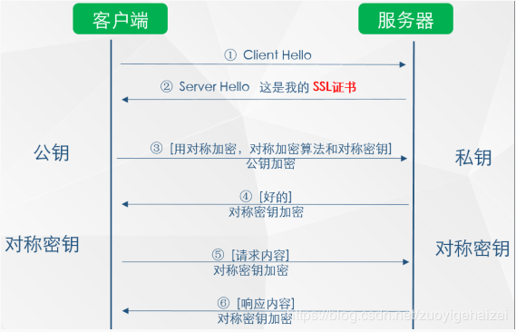

(PS：扫描[首页里面的二维码](README.md)进群，分享我自己在看的技术资料给大家，希望和大家一起学习进步！)

#### [1.HTTPS建立连接的过程是怎么样的？](#HTTPS建立连接的过程是怎么样的？)
#### [2.HTTP的缓存策略是怎么样的？](#HTTP的缓存策略是怎么样的？)

### HTTPS建立连接的过程是怎么样的？

在发起连接之前，服务器会将自己的公钥发给CA证书机构，CA证书机构会用自己的私钥对服务器的公钥加密，生成CA证书给服务器，服务器存储后供之后建立安全连接使用。

1.客户端发起请求，TCP三次握手，跟服务器建立连接。
如上图所示，在第 ② 步时服务器发送了一个SSL证书给客户端，SSL 证书中包含的具体内容有：

（1）证书的发布机构CA

（2）证书的有效期

（3）服务器的公钥

（4）证书所有者

（5）签名

3、客户端在接受到服务端发来的SSL证书时，会对证书的真伪进行校验，以浏览器为例说明如下：

（1）首先浏览器读取证书中的证书所有者、有效期等信息进行一一校验

（2）浏览器开始查找操作系统中已内置的受信任的证书发布机构CA证书，与服务器发来的证书中的颁发者CA比对，用于校验证书是否为合法机构颁发 。

（3）如果找不到，浏览器就会报错，说明服务器发来的证书是不可信任的。

（4）如果找到，那么浏览器就会从操作系统中取出  颁发者CA  的公钥，然后对服务器发来的证书里面的签名进行解密

（5）浏览器使用相同的hash算法计算出服务器发来的证书的hash值，将这个计算的hash值与证书中签名做对比

（6）对比结果一致，则证明服务器发来的证书合法，没有被冒充

（7）此时浏览器就可以读取证书中的公钥，用于后续加密了。

假设没有CA，那么如果服务器返回的包含公钥的包被hack截取，然后hack也生成一对公私钥，他将自己的公钥发给客户端。hack得到客户端数据后，解密，然后再通过服务器的公钥加密发给服务器，这样数据就被hack获取。
有了CA后，客户端根据内置的CA根证书，很容易识别出hack的公钥不合法，或者说hack的证书不合法。

### HTTP的缓存策略是怎么样的？

HTTP 缓存主要分为强缓存和对比缓存两种，从优先级上看，强缓存大于对比缓存。

#### 强缓存

 强缓缓存就是浏览器缓存数据库里有缓存数据就不再去向服务器发请求了

可以造成强制缓存的字段有Expires和Cache-Control两个：

Expires：该字段标识缓存到期时间，是一个绝对时间，也就是服务器时间+缓存有效时间。
缺点：如果客户端修改了本地时间，会造成缓存失效。如果本地时间与服务器时间不一致，也会导致缓存失效。

Cache-Control：该字段表示缓存最大有效时间，该时间是一个相对时间。
使用相对时间的话，即使本地时间与服务器时间不一致，也不会导致缓存失效。
 下面列举一下Cache-Control的字段可以带的值：

> - max-age：即最大有效时间
> - no-cache：表示没有缓存，即告诉浏览器该资源并没有设置缓存
> - s-maxage：同max-age，但是仅用于共享缓存，如CDN缓存
> - public：多用户共享缓存，默认设置
> - private：不能够多用户共享，HTTP认证之后，字段会自动转换成private。

#### 对比缓存

对比缓存的实现原理时，先给给服务器发请求，并且带上缓存的资源文件的缓存标识，让服务端进行对比，如果资源文件没有更改，就只返回header部分，body为空，状态码是304，浏览器使用缓存的资源文件。如果数据有更改，就返回更新后的资源文件。

可以实现对比缓存的机制有Last-Modified/If-Modified-Since和Etag/If-None-Match两种：

##### Last-Modified/If-Modified-Since
就是 请求的response header中会返回Last-Modified字段，代表资源文件最近的修改时间，发请求时 request header中会带上If-Modified-Since字段，代表上次获取的资源文件的最近修改时间，服务器判断资源文件是否有更新，来决定返回最新的资源文件（返回200），还是让浏览器使用缓存(返回304)。

缺点：

1. Last-Modified标注的最后修改只能精确到秒级，如果某些文件在1秒钟以内，被修改多次的话，它将不能准确标注文件的修改时间。

2. 如果某些文件会被定期生成，当有时内容并没有任何变化，但Last-Modified却改变了，导致文件没法使用缓存。

##### Etag/If-None-Match

就是 response header中会返回Etag，代表资源文件的版本号，发请求时 request header中会加上If-None-Match字段，值是上次请求的资源的文件的版本号，代表上次请求的资源文件的版本号，服务器判断资源文件是否有更新，来决定返回最新的资源文件（返回200），还是让浏览器使用缓存(返回304)。

##### 优先级

优先级方面排序是 强缓存（Cache-Control）> 强缓存（Expires）> 对比缓存（Etag/If-None-Match）> 对比缓存（Last-Modified/If-Modified-Since）

### TCP 三次握手和四次挥手是怎么样的？

#### 三次握手：

TCP是一个面向连接的可靠的传输协议。建立连接前需要进行三次握手。

流程如下：

1.客户端首先会生成一个随机数J作为数据包的序号，给服务端发送一个SYN包，包的序号seq设置为J，发送成功后，自己进入SYN_SENT 状态，代表发送SYN包成功，等待服务端的确认。

2.服务端收到SYN包之后，会进入到SYN_RECV状态，同时为了检测服务端到客户端是否通畅，会给客户端发送一个SYN包，将ACK设置为1，并且会带上ack=J+1，生成随机数作为包的序号，seq=K，用于确认之前收到了客户端发送的SYN包。

3.客户端收到服务端发送的SYN包后，会检测ACK标志位是否为1，并且ack是否等于J+1,如果是的话，就说明之前服务器收到了客户端发送的SYN包，并且服务端发送给客户端的SYN包也是可以收到的，所以需要给服务端发送ACK包，ACK=1，ack=K+1。

4.服务端收到ACK回应后，检查ack是否为K+1，ACK是否为1，如果正确则连接建立成功，客户端和服务器端进入ESTABLISHED状态，完成三次握手，随后客户端与服务器端之间可以开始传输数据了。

#### 四次挥手

TCP是全双工的连接，断开每一方向的连接都需要发送断开请求，断开确认。所以总共需要发送4个包才能确定连接的断开。

1.首先客户端给服务端发送一个FIN包，seq=J，客户端进入FIN_WAIT_1状态，代表客户端已经没有数据发送给服务端了。

2.服务端接收到FIN包之后，会给客户端发送一个ACK，ack=J+1，用于确认客户端-服务端这边的连接进行断开。同时会进入到CLOSE_WAIT状态，表示在等待关闭，因为服务端往客户端可能还在继续传输数据，暂时还不能断开。客户收到服务端返回的ACK回应后，会进入到FIN_WAIT_2状态，代表客户端-服务端的连接已经断开成功，等待服务端发送FIN包断开服务端-客户端的连接。

3.服务端发现没有数据发给客户端后，会发一个FIN包给客户端，并且进入LAST_ACK，代表等待客户端的ACK，一旦收到ACK，代表连接正式断开，服务端可以进入CLOSE状态。

4.客户端收到服务端发送的FIN包后，说明连接已经断开了，但是需要服务端知道，客户端会给服务端发送一个ACK包通知服务端，并且会进入TIME_WATING状态，代表超过超时时间后自动进入CLOSE状态，如果ACK包中途丢了，服务端会再发送FIN包，客户端会进行ACK包重发，这也是TIME_WAITING状态的意义。

### TCP有哪些特点？
TCP怎么保证可靠性的？
对发送的每个数据包都有一个序号，服务端收到数据包会返回一个ACK进行确认，如果在超过超时时间后，客户端还是没有收到服务端返回的ACK确认，就会对数据包进行超时重传。并且超时时间是动态变化的，初始值会大于正常的报文发送到接收到ACK回应的时间，重传后还没有得到回应会调大重传时间，然后进行重传。
例如：在Linux中，超时以500ms为单位进行控制，每次判定超时重发的超时时间都是500ms的整数倍。其规律为：如果重发一次仍得不到应答，就等待2500ms后再进行重传，如果仍然得不到应答就等待4500ms后重传，依次类推，以指数形式递增，重传次数累计到一定次数后，TCP认为网络或对端主机出现异常，就会强行关闭连接。

流量控制

因为发送端在发送的数据包的序号必须小于最大的滑动窗口值，所以当发送的数据包过多，导致接收端的缓冲区写满时，接收端会通知给客户端将滑动窗口设置为更小的值。

拥塞控制
慢开始
