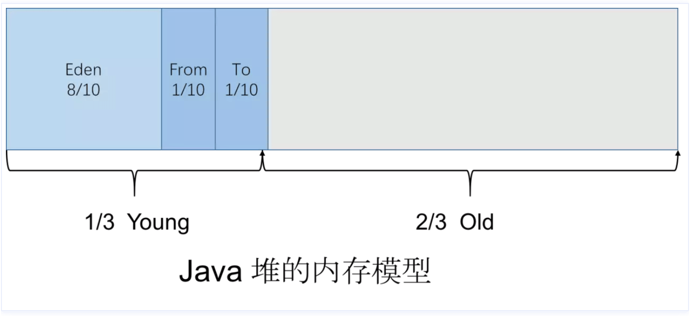
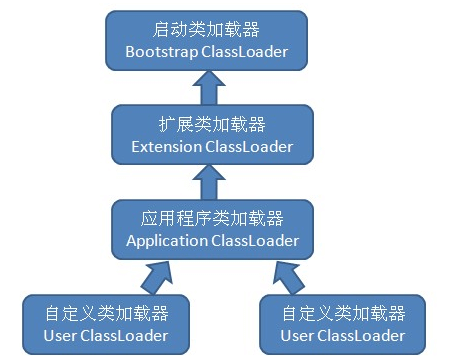

(PS：扫描[首页里面的二维码](README.md)进群，分享我自己在看的技术资料给大家，希望和大家一起学习进步！)

目前还只是买了最新版的[《深入理解JVM虚拟机 第三版》](backend/bookRecommend?#《深入理解Java虚拟机-第三版》),还没有完全看完，看完之后会从网上的面经中找一些实际的面试题，然后自己通过翻书查资料，写面试题解答。

####  [1.垃圾回收有哪些特点？](#垃圾回收有哪些特点？)

####  [2.在垃圾回收机制中，对象在内存中的状态有哪几种？](#在垃圾回收机制中，对象在内存中的状态有哪几种？)
####  [3.对象的强引用，软引用，弱引用和虚引用的区别是什么？](#对象的强引用，软引用，弱引用和虚引用的区别是什么？)
#### [4.垃圾回收算法有哪些？](#垃圾回收算法有哪些)
#### [4.Minor GC 和 Full GC是什么？](#Minor GC 和 Full GC是什么)
#### [5.如何确定一个对象可以回收？](#如何确定一个对象是否可以被回收)
#### [6.怎么自定义一个类加载器？](#怎么自定义一个类加载器)

### 垃圾回收有哪些特点？

垃圾回收具有以下特点：

1.只回收堆内存的对象，不回收其他物理资源（数据库连接等）

2.无法精准控制内存回收的时机，系统会在合适的时候进行内存回收。

3.在回收对象之前会调用对象的finalize()方法清理资源，这个方法有可能会让其他变量重新引用对象导致对象复活。

### 在垃圾回收机制中，对象在内存中的状态有哪几种？

1.可达状态

有一个及以上的变量引用着对象。

2.可恢复状态

已经没有变量引用对象了，但是还没有被调用finalize()方法。系统在回收前会调用finalize()方法，如果在执行finalize()方法时，重新让一个变量引用了对象，那么对象会变成可达状态，否则会变成不可达状态。

3.不可达状态

执行finalize()方法后，对象还是被变量引用，那么对象就变成了不可达状态。

### 对象的强引用，软引用，弱引用和虚引用的区别是什么？

##### 强引用

就是普通的变量对对象的引用，强引用的对象不会被系统回收。

##### 软引用

当内存空间足够时，软引用的对象不会被系统回收。当内存空间不足时，软引用的对象可能被系统回收。通常用于内存敏感的程序中。

##### 弱引用

引用级别比软引用低，对于只有软引用的对象，不管内存是否足够， 都可能会被系统回收。

##### 虚引用

虚引用主要用于跟踪对象被垃圾回收的状态，在垃圾回收时可以收到一个通知。

### JVM 内存区域分布是什么样的？gc 发生在哪些部分？

Java虚拟机的内存区域主要分为虚拟机栈，本地方法栈，程序计数器，堆，方法区。垃圾回收主要是对堆中的对象进行回收，方法区里面也会进行一些垃圾回收，但是毕竟少，主要是针对**常量池的回收** 和 **对类型的卸载**，判定一个常量是否是“废弃常量”比较简单，不被引用就行了，而要判定一个类是否是“无用的类”的条件则相对苛刻许多。类需要同时满足下面3个条件才能算是“无用的类”：

1.该类所有的实例都已经被回收，也就是Java堆中不存在该类的任何实例；

2.加载该类的ClassLoader已经被回收；

3.该类对应的 java.lang.Class 对象没有在任何地方被引用，无法在任何地方通过反射访问该类的方法。

##### 虚拟机栈

是Java方法执行的内存模型，主要是用于方法执行的，每次执行方法时就会创建一个栈帧来压入栈中，每个栈帧存储了方法调用需要的数据，例如局部变量表，操作数栈等。

局部变量表主要是存储方法的参数和创建的局部变量（基本类型或者引用类型），它的大小在编译时就固定了，方法有一个Code属性记录了需要的局部变量表的大小。

操作数栈是一个栈，主要用来做算术运算及调用其他方法时存储传参，调用其他方法时，当前方法栈帧的操作数栈会跟其他方法的局部变量表有一定的重叠，主要便于共享这些传递参数，节约内存空间。（最大深度也是编译时就计算好的。）

##### 本地方法栈

调用native方法时的栈

##### 程序计数器

跟虚拟机栈，本地方法栈一样，程序计数器也是线程私有的，主要用来记录当前线程执行的字节码指令的行号，字节码解释器通过改变这个计数器来选取下一条需要执行的字节码指令。

##### 堆

用来存储对象和数据的区域，被所有线程共享，在物理上可以是不连续的。

##### 方法区

方法区也是被线程共享的，主要存放类型信息，常量，静态变量，方法去中有一个运行时常量池。

Java中的类在编译后会生成class文件，class文件除了包含变量，方法，接口信息外还包含一个常量池表，用于存放编译时生成的各种字面量和符号引用，在类加载后，字符流常量池会被存放在方法区中的运行时常量池中，运行期间也会可以将新的常量添加到运行时常量池，例如对String的实例调用intern方法。


### 对象的创建过程是怎么样的？

#### 1.类加载检查

首先在代码里面创建对象使用的new关键字在编译时会编译成new字节码指令，然后Java虚拟机在执行这条指令时，首先会根据类名去方法区中的运行时常量池查找类的符号引用，检查**符号引用**对应的类是否已经加载，如果没有加载，那么进行类加载。如果已经加载了，那么进行内存分配。

#### 2.内存分配

Java虚拟机会从堆中申请一块大小确定的内存（因为类加载时，创建一个此类的实例对象的所需的内存大小就确定了），并且初始化为零值，根据采用的垃圾收集器的不同，内存分配方式有两种：

##### 指针碰撞

一些垃圾回收算法，回收后的可用内存是规整，只需要移动分界点的指针就可以内存分配。

##### 空闲列表

一些垃圾回收算法，回收后的可用内存是零散的，与已使用的内存是相互交错的，此时需要用一个列表来记录这些空闲的内存，分配内存时找一块足够的内存使用。（一般来说，使用标记-清除的垃圾算法是不规整的）

#### 3.对象初始化（虚拟机层面）

Java虚拟机层面会对对象做一些初始化操作， 将对象的一些信息存储到Obeject header。

##### 4.对象初始化（代码层面）

在Java程序层面，对对象进行初始化，在构造一个类的实例对象时，遵循的原则是先静后动，先变量，后代码块构造器，先父后子。在Java程序层面会依次进行以下操作：

- 初始化父类的静态变量（如果是首次使用此类）

- 初始化子类的静态变量（如果是首次使用此类）

- 执行父类的静态代码块（如果是首次使用此类）

- 执行子类的静态代码块（如果是首次使用此类）

- 初始化父类的实例变量

- 初始化子类的实例变量

- 执行父类的普通代码块

- 执行子类的普通代码块

- 执行父类的构造器

- 执行子类的构造器

### 垃圾回收算法有哪些？

垃圾回收算法一般有四种


#### 标记-清除算法

就是对要回收的对象进行标记，标记完成后统一回收。（CMS垃圾收集器使用这种）

缺点：

**效率不稳定**

执行效率不稳定，有大量对象时，并且有大量对象需要回收时，执行效率会降低。

**内存碎片化**

内存碎片化，会产生大量不连续的内存碎片。（内存碎片只能通过使用分区空闲分配链表来分配内存）

#### 标记-复制算法

就是将内存分为两块，每次只用其中一块，垃圾回收时将存活对象，拷贝到另一块内存。（serial new，parallel new和parallel scanvage垃圾收集器）

缺点：

**不适合存活率高的老年代**

存活率较高时需要很多复制操作，效率会降低，所以老年代一般不使用这种算法。

**浪费内存**

会浪费一半的内存，

解决方案是新生代的内存配比是Eden:From Survivor: To Survivor = 8:1:1

每次使用时，Eden用来分配新的对象，From Survivor存放上次垃圾回收存活的对象，只使用Eden和From Survivor的空间，To Survivor是空的，垃圾回收时将存活对象拷贝到To Survivor，当空间不够时，从老年代进行分配担保。

####标记-整理算法

就是让存活对象往内存空间一端移动，然后直接清理掉边界以外的内存。（parallel Old和Serial old收集器就是采用该算法进行回收的）

**吞吐量高**

移动时内存操作会比较复杂，需要移动存活对象并且更新所有对象的引用，会是一种比较重的操作，但是如果不移动的话，会有内存碎片，内存分配时效率会变低，所以由于内存分配的频率会比垃圾回收的频率高很多，所以从吞吐量方面看，标记-整理法高于标记-清除法，所以强调高吞吐量的Parallel Scavenge收集器是采用标记整理法。

**延迟高**

但是由于需要移动对象，停顿时间会比较长，垃圾回收时延迟会高一些，强调低延迟的CMS收集器一般是大部分时候用标记-清除算法，当内存碎片化程度达到一定程度时，触发Full GC，会使用标记-整理算法清理一次。

#### 分代收集算法

就是现在的系统一般都比较复杂，堆中的对象也会比较多，如果使用对所有对象都分析是否需要回收，那么效率会比较低，所以有了分代收集算法，就是对熬过垃圾回收次数不同的对象进行分类，分为新生代和老年代，采用不同回收策略。

新生代存活率低，使用标记-复制算法。新生代发生的垃圾收集交Minor GC，发生频率较高

老年代存活率高，使用标记-清除算法，或者标记-整理算法。（一般是多数时间采用标记-清除算法，内存碎片化程度较高时，使用标记-整理算法收集一次）。老年代内存满时会触发Major GC（Full GC），一般触发的频率比较低。

#### 如何确定一个对象是否可以被回收？
有两种算法，一种是引用计数法，可以记录每个对象被引用的数量来确定，当被引用的数量为0时，代表可以回收。
一种是可达性分析法。就是判断对象的引用链是否可达来确定对象是否可以回收。就是把所有对象之间的引用关系看成是一个图，通过从一些GC Roots对象作为起点，根据这些对象的引用关系一直向下搜索，走过的路径就是引用链，当所有的GCRoots对象的引用链都到达不了这个对象，说明这个对象不可达，可以回收。
GCRoots对象一般是当前肯定不会被回收的对象，一般是虚拟机栈中局部变量表中的对象，方法区的类静态变量引用的对象，方法区常量引用的对象，本地方法栈中Native方法引用的对象。

### Minor GC 和 Full GC是什么？

Minor GC：对新生代进行回收，不会影响到年老代。因为新生代的 Java 对象大多死亡频繁，所以 Minor GC 非常频繁，一般在这里使用速度快、效率高的算法，使垃圾回收能尽快完成。

Full GC：也叫 Major GC，对整个堆进行回收，包括新生代和老年代。由于Full GC需要对整个堆进行回收，所以比Minor GC要慢，因此应该尽可能减少Full GC的次数，导致Full GC的原因包括：老年代被写满和System.gc()被显式调用等。

### 垃圾收集器有哪些？

一般老年代使用的就是标记-整理，或者标记-清除+标记-整理结合（例如CMS）

新生代就是标记-复制算法

| 垃圾收集器                                  | 特点                                              | 算法                | 适用内存区域   |                      |
| ------------------------------------------- | ------------------------------------------------- | ------------------- | -------------- | -------------------- |
| Serial                                      | 单个GC线程进行垃圾回收，简单高效                  | 标记-复制           | 新生代         |                      |
| Serial Old                                  | 单个GC线程进行垃圾回收                            | 标记-整理           | 老年代         |                      |
| ParNew                                      | 是Serial的改进版，就是可以多个GC线程进行垃圾回收  | 标记-复制           | 新生代         |                      |
| Parallel Scanvenge收集器（吞吐量优先收集器) | 高吞吐量，吞吐量=执行用户线程的时间/CPU执行总时间 | 标记-复制           | 新生代         |                      |
| Parallel Old收集器                          | 支持多线程收集                                    | 标记-整理           | 老年代         |                      |
| CMS收集器（并发低停顿收集器）               | 低停顿                                            | 标记-清除+标记-整理 | 老年代         |                      |
| G1收集器                                    | 低停顿，高吞吐量                                  | 标记-整理算法       | 老年代，新生代 | JDK9的默认垃圾收集器 |

### 垃圾收集器相关的参数

-XX:+UseSerialGC，	虚拟机运行在Client 模式下的默认值，打开此开关后，使用Serial + Serial Old 的收集器组合进行内存回收

-XX:+UseConcMarkSweepGC，打开此开关后，使用ParNew + CMS + Serial Old 的收集器组合进行内存回收。Serial Old 收集器将作为CMS 收集器出现Concurrent Mode Failure失败后的后备收集器使用。（我们的线上服务用的都是这个）

-XX:+UseParallelGC，虚拟机运行在Server 模式下的默认值，打开此开关后，使用Parallel Scavenge + Serial Old（PS MarkSweep）的收集器组合进行内存回收。

-XX:+UseParallelOldGC，打开此开关后，使用Parallel Scavenge + Parallel Old 的收集器组合进行内存回收。

-XX:+UseG1GC，打开此开关后，采用 Garbage First (G1) 收集器

-XX:+UseParNewGC，在JDK1.8被废弃，在JDK1.7还可以使用。打开此开关后，使用ParNew + Serial Old 的收集器组合进行内存回收


### 内存分配策略有哪些？

#### 内存划分策略：



Serial收集器中，新生代与老年代的内存分配是1：2，然后新生代分为Eden区，From区，To区，8:1:1。

##### 新生代

分为Eden，From Survivor，To Survivor，8：1：1

Eden用来分配新对象，满了时会触发Minor GC。

From Survivor是上次Minor GC后存活的对象。

To Survivor是用于下次Minor GC时存放存活的对象。

##### 老年代

用于存放存活时间比较长的对象，大的对象，当容量满时会触发Major GC（Full GC）

#### 内存分配策略：

1) 对象优先在Eden分配

当Eden区没有足够空间进行分配时，虚拟机将发起一次MinorGC。现在的商业虚拟机一般都采用复制算法来回收新生代，将内存分为一块较大的Eden空间和两块较小的Survivor空间，每次使用Eden和其中一块Survivor。 当进行垃圾回收时，将Eden和Survivor中还存活的对象一次性地复制到另外一块Survivor空间上，最后处理掉Eden和刚才的Survivor空间。（HotSpot虚拟机默认Eden和Survivor的大小比例是8:1）当Survivor空间不够用时，需要依赖老年代进行分配担保。

2) 大对象直接进入老年代

所谓的大对象是指，需要大量连续内存空间的Java对象，最典型的大对象就是那种很长的字符串以及数组，为了避免大对象在Eden和两个Survivor区之间进行来回复制，所以当对象超过-XX:+PrintTenuringDistribution参数设置的大小时，直接从老年代分配

3) 长期存活的对象将进入老年代。

当对象在新生代中经历过一定次数（XX:MaxTenuringThreshold参数设置的次数，默认为15）的Minor GC后，就会被晋升到老年代中。

4) 动态对象年龄判定。

为了更好地适应不同程序的内存状况，虚拟机并不是永远地要求对象年龄必须达到了MaxTenuringThreshold才能晋升老年代，如果在Survivor空间中相同年龄所有对象大小的总和大于Survivor空间的一半，年龄大于或等于该年龄的对象就可以直接进入老年代，无须等到MaxTenuringThreshold中要求的年龄。


### 怎么查询当前JVM使用的垃圾收集器？

使用这个命令可以查询
java -XX:+PrintCommandLineFlags -version
我们在IDEA中启动的一个Springboot的项目，默认使用的垃圾收集器参数是
-XX:+UseParallelGC
```
-XX:InitialHeapSize=134217728 -XX:MaxHeapSize=2147483648 -XX:+PrintCommandLineFlags -XX:+UseCompressedClassPointers -XX:+UseCompressedOops -XX:+UseParallelGC 
java version "1.8.0_73"
Java(TM) SE Runtime Environment (build 1.8.0_73-b02)
Java HotSpot(TM) 64-Bit Server VM (build 25.73-b02, mixed mode)
```
UseParallelGC参数会使用Parallel Scavenge+Serial Old的收集器组合，进行内存回收。


另外这个命令可以查询到更加详细的信息

java -XX:+PrintFlagsFinal -version | grep GC

##### JVM相关的异常

#### 1.stackoverflow

这种就是栈的空间不足，就会抛出这个异常，一般是递归执行一个方法时，执行方法深度太深时出现。Java执行一个方法时，会创建一个栈帧来存放局部变量表，操作数栈，如果分配栈帧时，栈空间不足，那么就会抛出这个异常。

（栈空间可以设置-Xss参数实现，默认为1M，如果参数）


### 双亲委派机制是什么？



就是类加载器一共有三种：

**启动类加载器**：主要是在加载JAVA_HOME/lib目录下的特定名称jar包，例如rt.jar包，像java.lang就在这个jar包中。

**扩展加载器**：主要是加载JAVA_HOME/lib/ext目录下的具备通用性的类库。

**应用程序加载器**：加载用户类路径下所有的类库，也就是程序中默认的类加载器。

工作流程：

除启动类加载器以外，所有类加载器都有自己的父类加载器，类加载器收到一个类加载请求时，首先会判断类是否已经加载过了，没有的话会调用父类加载器的的loadClass方法，将请求委派为父加载器，当父类加载器无法完成类加载请求时，子加载器才尝试去加载这个类。
目的是为了保证每个类只加载一次，并且是由特定的类加载器进行加载（都是首先让启动类来进行加载）。

```java
public abstract class ClassLoader {
    ...
    public Class<?> loadClass(String name) throws ClassNotFoundException {
        return loadClass(name, false);
    }
    protected Class<?> loadClass(String name, boolean resolve)
        throws ClassNotFoundException {
        synchronized (getClassLoadingLock(name)) {
            Class<?> c = findLoadedClass(name);
            if (c == null) {
                ...
                try {
                    if (parent != null) {
                        c = parent.loadClass(name, false);
                    } else {
                        c = findBootstrapClassOrNull(name);
                    }
                } catch (ClassNotFoundException e) {
                }

                if (c == null) {
                    ...
                    c = findClass(name);
                    // do some stats
                    ...
                }
            }
            if (resolve) {
                resolveClass(c);
            }
            return c;
        }
    }
    protected Class<?> findClass(String name) throws ClassNotFoundException {
        throw new ClassNotFoundException(name);
    }
    ...
}
```

### 怎么自定义一个类加载器？

加载一个类时，一般是调用类加载器的loadClass()方法来加载一个类，loadClass()方法的工作流程如下：

1.先调用findLoadedClass(className)来获取这个类，判断类是否已加载。

2.如果未加载，如果父类加载器不为空，调用父类加载器的loadClass()来加载这个类，父类加载器为空，就调用父类加载器加载这个类。

3.父类加载器加载失败，那么调用该类加载器findClass(className)方法来加载这个类。

所以我们我们一般自定义类加载器都是继承ClassLoader，来重新findClass()方法，来实现类加载。

```java
public class DelegationClassLoader extends ClassLoader {
  private String classpath;

  public DelegationClassLoader(String classpath, ClassLoader parent) {
    super(parent);
    this.classpath = classpath;
  }

  @Override
  protected Class<?> findClass(String name) throws ClassNotFoundException {
    InputStream is = null;
    try {
      String classFilePath = this.classpath + name.replace(".", "/") + ".class";
      is = new FileInputStream(classFilePath);
      byte[] buf = new byte[is.available()];
      is.read(buf);
      return defineClass(name, buf, 0, buf.length);
    } catch (IOException e) {
      throw new ClassNotFoundException(name);
    } finally {
      if (is != null) {
        try {
          is.close();
        } catch (IOException e) {
          throw new IOError(e);
        }
      }
    }
  }

  public static void main(String[] args)
      throws ClassNotFoundException, IllegalAccessException, InstantiationException,
      MalformedURLException {
    sun.applet.Main main1 = new sun.applet.Main();

    DelegationClassLoader cl = new DelegationClassLoader("java-study/target/classes/",
        getSystemClassLoader());
    String name = "sun.applet.Main";
    Class<?> clz = cl.loadClass(name);
    Object main2 = clz.newInstance();

    System.out.println("main1 class: " + main1.getClass());
    System.out.println("main2 class: " + main2.getClass());
    System.out.println("main1 classloader: " + main1.getClass().getClassLoader());
    System.out.println("main2 classloader: " + main2.getClass().getClassLoader());
    ClassLoader itrCl = cl;
    while (itrCl != null) {
      System.out.println(itrCl);
      itrCl = itrCl.getParent();
    }
  }
}
```

### 类加载的过程是什么样的？

#### 类加载器

类加载器是 Java 运行时环境（Java Runtime Environment）的一部分，负责动态加载 Java 类到 Java 虚拟机的内存空间中。**类通常是按需加载，即第一次使用该类时才加载。** 由于有了类加载器，Java 运行时系统不需要知道文件与文件系统。每个 Java 类必须由某个类加载器装入到内存。


类装载器除了要定位和导入二进制 class 文件外，还必须负责验证被导入类的正确性，为变量分配初始化内存，以及帮助解析符号引用。这些动作必须严格按一下顺序完成：

1. **装载**：查找并装载类型的二进制数据。
2. **链接**：执行验证、准备以及解析(可选) -
 -**验证**：确保被导入类型的正确性 
 -**准备**：为类变量分配内存，并将其初始化为默认值。
 - **解析**：把类型中的符号引用转换为直接引用。
3. **初始化**：把类变量初始化为正确的初始值。

#### 装载

##### 类加载器分类

在Java虚拟机中存在多个类装载器，Java应用程序可以使用两种类装载器：

- **Bootstrap ClassLoader**：此装载器是 Java 虚拟机实现的一部分。由原生代码（如C语言）编写，不继承自 `java.lang.ClassLoader` 。负责加载核心 Java 库，启动类装载器通常使用某种默认的方式从本地磁盘中加载类，包括 Java API。
- **Extention Classloader**：用来在`<JAVA_HOME>/jre/lib/ext` ,或 `java.ext.dirs` 中指明的目录中加载 Java 的扩展库。 Java 虚拟机的实现会提供一个扩展库目录。
- **Application Classloader**：根据 Java应用程序的类路径（ `java.class.path` 或 `CLASSPATH` 环境变量）来加载 Java 类。一般来说，Java 应用的类都是由它来完成加载的。可以通过 `ClassLoader.getSystemClassLoader()` 来获取它。
- **自定义类加载器**：可以通过继承 `java.lang.ClassLoader` 类的方式实现自己的类加载器，以满足一些特殊的需求而不需要完全了解 Java 虚拟机的类加载的细节。

##### 全盘负责双亲委托机制

在一个 JVM 系统中，至少有 3 种类加载器，那么这些类加载器如何配合工作？在 JVM 种类加载器通过 **全盘负责双亲委托机制** 来协调类加载器。

- **全盘负责**：指当一个 `ClassLoader` 装载一个类的时，除非显式地使用另一个 `ClassLoader` ，该类所依赖及引用的类也由这个 `ClassLoader` 载入。
- **双亲委托机制**：指先委托父装载器寻找目标类，只有在找不到的情况下才从自己的类路径中查找并装载目标类。

全盘负责双亲委托机制只是 Java 推荐的机制，并不是强制的机制。实现自己的类加载器时，如果想保持双亲委派模型，就应该重写 `findClass(name)` 方法；如果想破坏双亲委派模型，可以重写 `loadClass(name)` 方法。

##### 装载入口

所有Java虚拟机实现必须在每个类或接口首次主动使用时初始化。以下六种情况符合主动使用的要求：

- 当创建某个类的新实例时(new、反射、克隆、序列化)
- 调用某个类的静态方法
- 使用某个类或接口的静态字段，或对该字段赋值(用final修饰的静态字段除外，它被初始化为一个编译时常量表达式)
- 当调用Java API的某些反射方法时。
- 初始化某个类的子类时。
- 当虚拟机启动时被标明为启动类的类。

除以上六种情况，所有其他使用Java类型的方式都是被动的，它们不会导致Java类型的初始化。
当类是被动引用时，不会触发初始化：

1.通过子类去调用父类的静态变量，不会触发子类的初始化，只会触发包含这个静态变量的类初始化，例如执行这样的代码`SubClass.fatherStaticValue`只会触发FatherClass的初始化，不会触发SubClass的初始化，因为fatherStaticValue是FatherClass的变量

2.通过数组定义类引用类，SuperClass[] array = new SuperClass[10];

不会触发SuperClass类的初始化，但是执行字节码指令newarray会触发另外一个类[Lorg.fenixsoft.classloading.SuperClass的初始化，这个类继承于Object类，是一个包装类，里面包含了访问数组的所有方法，

3.只引用类的常量不会触发初始化,因为常量在编译阶段进入常量池

```java
class SuperClass {
		public static final String str = "hello";
}

//引用常量编译时会直接存入常量池
System.out.println(SuperClass.str);

```

对于接口来说，只有在某个接口声明的非常量字段被使用时，该接口才会初始化，而不会因为事先这个接口的子接口或类要初始化而被初始化。

**父类需要在子类初始化之前被初始化**。当实现了接口的类被初始化的时候，不需要初始化父接口。然而，当实现了父接口的子类(或者是扩展了父接口的子接口)被装载时，父接口也要被装载。(只是被装载，没有初始化)

#### 验证

确认装载后的类型符合Java语言的语义，并且不会危及虚拟机的完整性。

- **装载时验证**：检查二进制数据以确保数据全部是预期格式、确保除 Object 之外的每个类都有父类、确保该类的所有父类都已经被装载。
- **正式验证阶段**：检查 final 类不能有子类、确保 final 方法不被覆盖、确保在类型和超类型之间没有不兼容的方法声明(比如拥有两个名字相同的方法，参数在数量、顺序、类型上都相同，但返回类型不同)。
- **符号引用的验证**：当虚拟机搜寻一个被符号引用的元素(类型、字段或方法)时，必须首先确认该元素存在。如果虚拟机发现元素存在，则必须进一步检查引用类型有访问该元素的权限。

#### 准备

在准备阶段，Java虚拟机为类变量分配内存，**设置默认初始值**。但在到到初始化阶段之前，类变量都没有被初始化为真正的初始值。

| 类型      | 默认值   |
| --------- | -------- |
| int       | 0        |
| long      | 0L       |
| short     | (short)0 |
| char      | ’\u0000’ |
| byte      | (byte)0  |
| blooean   | false    |
| float     | 0.0f     |
| double    | 0.0d     |
| reference | null     |

#### 解析

https://www.zhihu.com/question/30300585

解析的过程就是在类型的常量池总寻找类、接口、字段和方法的符号引用，**把这些符号引用替换为直接引用的过程**。

- `类或接口的解析`：判断所要转化成的直接引用是数组类型，还是普通的对象类型的引用，从而进行不同的解析。
- `字段解析`：对字段进行解析时，会先在本类中查找是否包含有简单名称和字段描述符都与目标相匹配的字段，如果有，则查找结束；如果没有，则会按照继承关系从上往下递归搜索该类所实现的各个接口和它们的父接口，还没有，则按照继承关系从上往下递归搜索其父类，直至查找结束，

#### 初始化

**所有的类变量(即静态量)初始化语句和类型的静态初始化器都被Java编译器收集在一起，放到一个特殊的方法中，这个步骤就是初始化类静态变量和执行静态代码块。** 对于类来说，这个方法被称作类初始化方法；对于接口来说，它被称为接口初始化方法。在类和接口的 class 文件中，这个方法被称为`<clinit>`。

1. 如果存在直接父类，且直接父类没有被初始化，先初始化直接父类。
2. 如果类存在一个类初始化方法，执行此方法。

这个步骤是递归执行的，即第一个初始化的类一定是`Object`。

**Java虚拟机必须确保初始化过程被正确地同步。** 如果多个线程需要初始化一个类，仅仅允许一个线程来进行初始化，其他线程需等待。

> 这个特性可以用来写单例模式。

##### Clinit 方法

- 对于静态变量和静态初始化语句来说：执行的顺序和它们在类或接口中出现的顺序有关。
- **并非所有的类都需要在它们的class文件中拥有<clinit>()方法，** 如果类没有声明任何类变量，也没有静态初始化语句，那么它就不会有`<clinit>()`方法。如果类声明了类变量，但没有明确的使用类变量初始化语句或者静态代码块来初始化它们，也不会有`<clinit>()`方法。如果类仅包含静态`final`常量的类变量初始化语句，而且这些类变量初始化语句采用编译时常量表达式，类也不会有`<clinit>()`方法。**只有那些需要执行Java代码来赋值的类才会有<clinit>()**
- `final`常量：Java虚拟机在使用它们的任何类的常量池或字节码中直接存放的是它们表示的常量值。