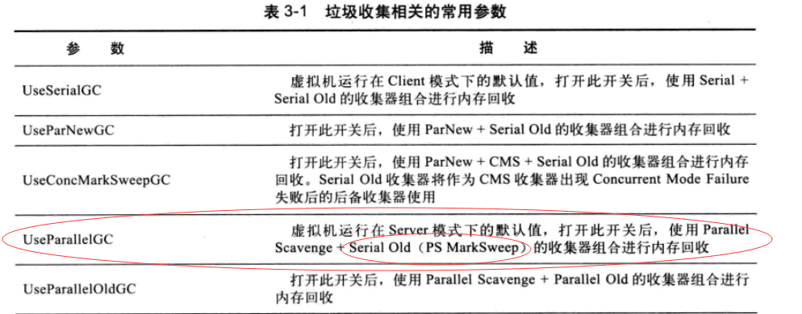

(PS：扫描[首页里面的二维码](README.md)进群，分享我自己在看的技术资料给大家，希望和大家一起学习进步！)

目前还只是买了最新版的[《深入理解JVM虚拟机 第三版》](backend/bookRecommend?#《深入理解Java虚拟机-第三版》),还没有完全看完，看完之后会从网上的面经中找一些实际的面试题，然后自己通过翻书查资料，写面试题解答。

####  [1.垃圾回收有哪些特点？](#垃圾回收有哪些特点？)

####  [2.在垃圾回收机制中，对象在内存中的状态有哪几种？](#在垃圾回收机制中，对象在内存中的状态有哪几种？)
####  [3.对象的强引用，软引用，弱引用和虚引用的区别是什么？](#对象的强引用，软引用，弱引用和虚引用的区别是什么？)

### 垃圾回收有哪些特点？

垃圾回收具有以下特点：

1.只回收堆内存的对象，不回收其他物理资源（数据库连接等）

2.无法精准控制内存回收的时机，系统会在合适的时候进行内存回收。

3.在回收对象之前会调用对象的finalize()方法清理资源，这个方法有可能会让其他变量重新引用对象导致对象复活。

### 在垃圾回收机制中，对象在内存中的状态有哪几种？

1.可达状态

有一个及以上的变量引用着对象。

2.可恢复状态

已经没有变量引用对象了，但是还没有被调用finalize()方法。系统在回收前会调用finalize()方法，如果在执行finalize()方法时，重新让一个变量引用了对象，那么对象会变成可达状态，否则会变成不可达状态。

3.不可达状态

执行finalize()方法后，对象还是被变量引用，那么对象就变成了不可达状态。

### 对象的强引用，软引用，弱引用和虚引用的区别是什么？

##### 强引用

就是普通的变量对对象的引用，强引用的对象不会被系统回收。

##### 软引用

当内存空间足够时，软引用的对象不会被系统回收。当内存空间不足时，软引用的对象可能被系统回收。通常用于内存敏感的程序中。

##### 弱引用

引用级别比软引用低，对于只有软引用的对象，不管内存是否足够， 都可能会被系统回收。

##### 虚引用

虚引用主要用于跟踪对象被垃圾回收的状态，不能单独使用，必须和引用队列联合使用。

### JVM 内存区域分布是什么样的？gc 发生在哪些部分？

Java虚拟机的内存区域主要分为虚拟机栈，本地方法栈，程序计数器，堆，方法区。垃圾回收主要是对堆中的对象进行回收，方法区里面也会进行一些垃圾回收，但是毕竟少，主要是针对类型的卸载，常量池中变量的回收。

##### 虚拟机栈

主要是用于方法执行的，每次执行方法时就会创建一个栈帧来存放局部变量表，操作数栈等。

局部变量表主要是存储方法的参数和创建的局部变量（基本类型或者引用类型），它的大小在编译时就固定了，方法有一个Code属性记录了需要的局部变量表的大小。

操作数栈是一个栈，主要用来做算术运算及调用其他方法时存储传参，调用其他方法时，当前方法栈帧的操作数栈会跟其他方法的局部变量表有一定的重叠，主要便于共享这些传递参数，节约内存空间。（最大深度也是编译时就计算好的。）

##### 本地方法栈

调用native方法时的栈

##### 程序计数器

跟虚拟机栈，本地方法栈一样，程序计数器也是线程私有的，主要用来记录当前线程执行的字节码指令的行号。

##### 堆

用来存储对象和数据的区域，被所有线程共享，在物理上可以是不连续的。

##### 方法区

方法区也是被线程共享的，主要存放类型信息，常量，静态变量，方法去中有一个运行时常量池。

Java中的类在编译后会生成class文件，class文件除了包含变量，方法，接口信息外还包含一个常量池表，用于存放编译时生成的各种字面量和符号引用，在类加载后，字符流常量池会被存放在方法区中的运行时常量池中，运行期间也会可以将新的常量添加到运行时常量池，例如对String的实例调用intern方法。


### 对象的创建过程是怎么样的？

#### 1.类加载检查

首先在代码里面创建对象使用的new关键字在编译时会编译成new字节码指令，然后Java虚拟机在执行这条指令时，首先会根据类名去方法区中的运行时常量池查找类的符号引用，检查**符号引用**对应的类是否已经加载，如果没有加载，那么进行类加载。如果已经加载了，那么进行内存分配。

#### 2.内存分配

Java虚拟机会从堆中申请一块大小确定的内存（因为类加载时，创建一个此类的实例对象的所需的内存大小就确定了），并且初始化为零值，根据采用的垃圾收集器的不同，内存分配方式有两种：

##### 指针碰撞

一些垃圾回收算法，回收后的可用内存是规整，只需要移动分界点的指针就可以内存分配。

##### 空闲列表

一些垃圾回收算法，回收后的可用内存是零散的，与已使用的内存是相互交错的，此时需要用一个列表来记录这些空闲的内存，分配内存时找一块足够的内存使用。（一般来说，使用标记-清除的垃圾算法是不规整的）

#### 3.对象初始化（虚拟机层面）

Java虚拟机层面会对对象做一些初始化操作， 将对象的一些信息存储到Obeject header。

##### 4.对象初始化（代码层面）

在Java程序层面，对对象进行初始化，在构造一个类的实例对象时，遵循的原则是先静后动，先变量，后代码块构造器，先父后子。在Java程序层面会依次进行以下操作：

- 初始化父类的静态变量（如果是首次使用此类）

- 初始化子类的静态变量（如果是首次使用此类）

- 执行父类的静态代码块（如果是首次使用此类）

- 执行子类的静态代码块（如果是首次使用此类）

- 初始化父类的实例变量

- 初始化子类的实例变量

- 执行父类的普通代码块

- 执行子类的普通代码块

- 执行父类的构造器

- 执行子类的构造器

### 怎么查询当前JVM使用的垃圾收集器？
使用这个命令可以查询
java -XX:+PrintCommandLineFlags -version
我们在IDEA中启动的一个Springboot的项目，默认使用的垃圾收集器参数是
-XX:+UseParallelGC
```
-XX:InitialHeapSize=134217728 -XX:MaxHeapSize=2147483648 -XX:+PrintCommandLineFlags -XX:+UseCompressedClassPointers -XX:+UseCompressedOops -XX:+UseParallelGC 
java version "1.8.0_73"
Java(TM) SE Runtime Environment (build 1.8.0_73-b02)
Java HotSpot(TM) 64-Bit Server VM (build 25.73-b02, mixed mode)
```
UseParallelGC参数会使用Parallel Scavenge+Serial Old的收集器组合，进行内存回收。


另外这个命令可以查询到更加详细的信息

java -XX:+PrintFlagsFinal -version | grep GC

