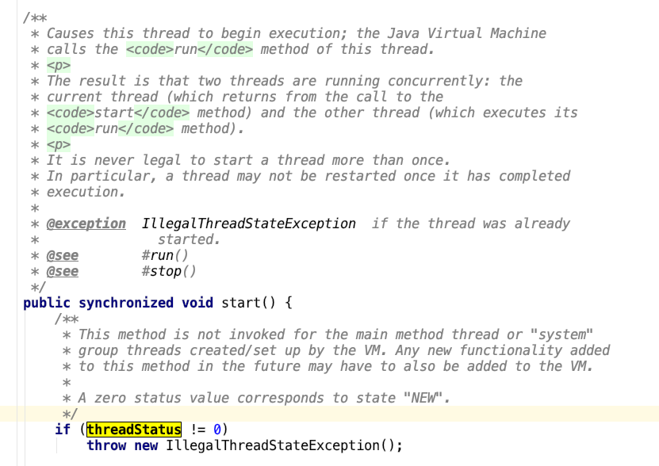
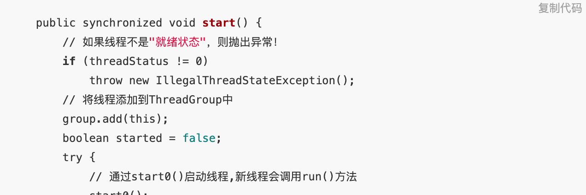
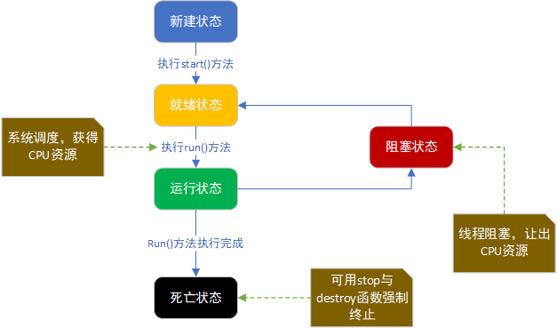
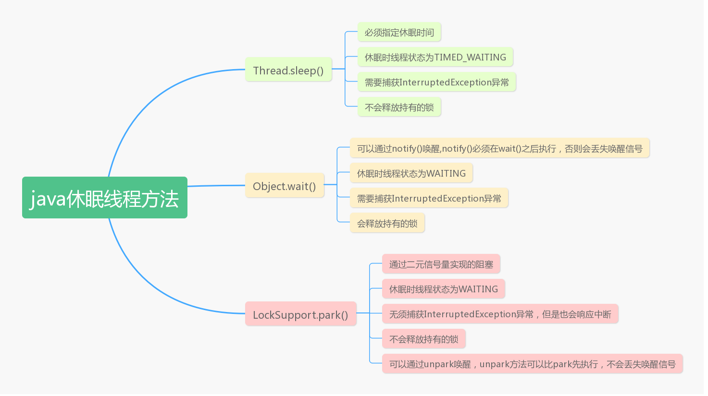
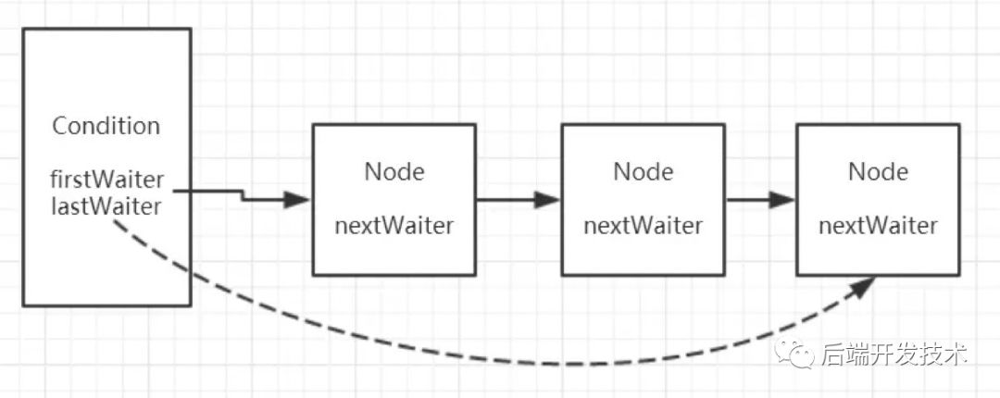
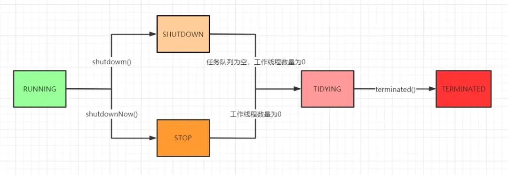

(PS：扫描[首页里面的二维码](README.md)进群，分享我自己在看的技术资料给大家，希望和大家一起学习进步！)
# 多线程专题

#### [1.进程与线程的区别是什么？](#进程与线程的区别是什么？)
#### [2.进程间如何通信？](#进程间如何通信？)
#### [3.Java中单例有哪些写法？](#Java中单例有哪些写法？)
####  [4.Java中创建线程有哪些方式?](#Java中创建线程有哪些方式?)
#### [5.如何解决序列化时可以创建出单例对象的问题?](#如何解决序列化时可以创建出单例对象的问题?)
#### [6.悲观锁和乐观锁是什么？](#悲观锁和乐观锁是什么？)
#### [7.volatile关键字有什么用？怎么理解可见性，一般什么场景去用可见性？](#volatile关键字有什么用？怎么理解可见性，一般什么场景去用可见性？)
#### [8.Java中线程的状态是怎么样的？](#Java中线程的状态是怎么样的？)
#### [9.wait()，join()，sleep()方法有什么作用？](#wait()，join()，sleep()方法有什么作用？)
#### [10.Thread.sleep(),Object.wait(),LockSupport.park()有什么区别？](#Thread.sleep(),Object.wait(),LockSupport.park()有什么区别？)
#### [11.谈一谈你对线程中断的理解？](#谈一谈你对线程中断的理解？)
#### [12.线程间怎么通信？](#线程间怎么通信？)
#### [13.怎么实现实现一个生产者消费者？](#怎么实现实现一个生产者消费者？)
#### [14.谈一谈你对线程池的理解？](#谈一谈你对线程池的理解？)
#### [15.线程池有哪些状态？](#线程池有哪些状态？)

### 进程与线程的区别是什么？
#### 批处理操作系统

**批处理操作系统**就是把一系列需要操作的指令写下来，形成一个清单，一次性交给计算机。用户将多个需要执行的程序写在磁带上，然后交由计算机去读取并逐个执行这些程序，并将输出结果写在另一个磁带上。

批处理操作系统在一定程度上提高了计算机的效率，但是由于**批处理操作系统的指令运行方式仍然是串行的，内存中始终只有一个程序在运行**，后面的程序需要等待前面的程序执行完成后才能开始执行，而前面的程序有时会由于I/O操作、网络等原因阻塞，导致CPU闲置所以**批处理操作效率也不高**。

#### 进程的提出

批处理操作系统的瓶颈在于内存中只存在一个程序，进程的提出，可以让内存中存在多个程序，每个程序对应一个进程，进程是操作系统资源分配的最小单位。CPU采用时间片轮转的方式运行进程：CPU为每个进程分配一个时间段，称作它的时间片。如果在时间片结束时进程还在运行，则暂停这个进程的运行，并且CPU分配给另一个进程（这个过程叫做上下文切换）。如果进程在时间片结束前阻塞或结束，则CPU立即进行切换，不用等待时间片用完。多进程的好处在于一个在进行IO操作时可以让出CPU时间片，让CPU执行其他进程的任务。

#### 线程的提出

随着计算机的发展，对CPU的要求越来越高，进程之间的切换开销较大，已经无法满足越来越复杂的程序的要求了。于是就发明了线程，线程是程序执行中一个单一的顺序控制流程，是程序执行流的最小单元，是处理器调度和分派的基本单位。一个进程可以有一个或多个线程，各个线程之间共享程序的内存空间(也就是所在进程的内存空间)。

#### 进程和线程的区别

进程是计算机中已运行程序的实体，进程是操作系统资源分配的最小单位。而线程是在进程中执行的一个任务，是CPU调度和执行的最小单位。他们两个本质的区别是是否**单独占有内存地址空间及其它系统资源（比如I/O）**：

* 进程单独占有一定的内存地址空间，所以进程间存在内存隔离，数据是分开的，数据共享复杂但是同步简单，各个进程之间互不干扰；而线程共享所属进程占有的内存地址空间和资源，数据共享简单，但是同步复杂。

* 进程单独占有一定的内存地址空间，一个进程出现问题不会影响其他进程，不影响主程序的稳定性，可靠性高；一个线程崩溃可能影响整个程序的稳定性，可靠性较低。

* 进程单独占有一定的内存地址空间，进程的创建和销毁不仅需要保存寄存器和栈信息，还需要资源的分配回收以及页调度，开销较大；线程只需要保存寄存器和栈信息，开销较小。

另外一个重要区别是，进程是操作系统进行资源分配的基本单位，而线程是操作系统进行调度的基本单位，即CPU分配时间的单位 。

#### 独立性

Linux系统会给每个进程分配4G的虚拟地址空间(0到3G是User地址空间，3到4G部分是kernel地址空间)，进程具备私有的地址空间，未经允许，一个用户进程不能访问其他进程的地址空间。

#### 动态性

程序是一个静态的指令集合，而进程是正在操作系统中运行的指令集合，进程有自己的生命周期和各种不同的状态。（五态模型一般指的是新建态（创建一个进程），就绪态（已经获取到资源，准备好了，进入运行队列，一旦获得时间片可以立即执行），阻塞态（运行过程中等待获取其他资源，I/O请求等），终止态（进程被杀死了））。

#### 并发性

多个进程可以在CPU上并发执行。
线程是独立运行和调度的最小单位，线程会共享进程的虚拟空间，一个进程会对应多个线程。在Java中，线程拥有自己私有的程序计数器，虚拟机栈，本地方法栈。

#### PS:虚拟内存

虚拟内存是一种逻辑上扩充物理内存的技术。基本思想是用软、硬件技术把内存与外存这两级存储器当做一级存储器来用。虚拟内存技术的实现利用了自动覆盖和交换技术。简单的说就是将硬盘的一部分作为内存来使用。

#### PS:虚拟地址空间

每个进程有4G的地址空间，在运行程序时，只有一部分数据是真正加载到内存中的，内存管理单元将虚拟地址转换为物理地址，如果内存中不存在这部分数据，那么会使用页面置换方法，将内存页置换出来，然后将外存中的数据加入到内存中，使得程序正常运行。

### 进程间如何通信？

进程间通信的方式主要有管道，

#### 管道

调用pipe函数在内存中开辟一块缓冲区，管道半双工的（即数据只能在一个方向上流动），具有固定的读端和写端，调用

```
#include <unistd.h>
int pipe(int pipefd[2]);
```

### Java中创建线程有哪些方式?

#### 第一种 继承Thread类，重写Run方法

这种方法就是通过自定义CustomThread类继承Thread类，重写run()方法，然后创建CustomThread的对象，然后调用start()方法，JVM会创建出一个新线程，并且为线程创建方法调用栈和程序计数器，此时线程处于就绪状态，当线程获取CPU时间片后，线程会进入到运行状态，会去调用run()方法。并且创建CustomThread类的对象的线程(这里的例子中是主线程)与调用run()方法的线程之间是并发的，也就是在执行run()方法时，主线程可以去执行其他操作。

```java
class CustomThread extends Thread {
    public static void main(String[] args) {
        System.out.println(Thread.currentThread().getName()+"线程调用了main方法");
        for (int i = 0; i < 10; i++) {
            if (i == 1) {
                CustomThread customThread = new CustomThread();
                customThread.start();
                System.out.println(Thread.currentThread().getName()+"线程--i是"+i);
            }
        }
        System.out.println("main()方法执行完毕！");
    }
    void run() {
        System.out.println(Thread.currentThread().getName()+"线程调用了run()方法");
        for (int j = 0; j < 20; j++) {
            System.out.println(Thread.currentThread().getName()+"线程--j是"+j);
        }
        System.out.println("run()方法执行完毕！");
    }
}
```

输出结果如下：

```
main线程调用了main方法
Thread-0线程调用了run()方法
Thread-0线程--j是0
Thread-0线程--j是1
Thread-0线程--j是2
Thread-0线程--j是3
Thread-0线程--j是4
Thread-0线程--j是5
Thread-0线程--j是6
Thread-0线程--j是7
Thread-0线程--j是8
Thread-0线程--j是9
Thread-0线程--j是10
Thread-0线程--j是11
Thread-0线程--j是12
Thread-0线程--j是13
Thread-0线程--j是14
main线程--i是1
Thread-0线程--j是15
Thread-0线程--j是16
Thread-0线程--j是17
Thread-0线程--j是18
Thread-0线程--j是19
run()方法执行完毕！
main()方法执行完毕！
```

可以看到在创建一个CustomThread对象，调用start()方法后，Thread-0调用了run方法，进行for循环，对j进行打印，与此同时，main线程并没有被阻塞，而是继续执行for循环，对i进行打印。

##### 执行原理

首先我们可以来看看start的源码，首先会判断threadStatus是否为0，如果不为0会抛出异常。然后会将当前对象添加到线程组，最后调用start0方法，因为是native方法，看不到源码，根据上面的执行结果来看，JVM新建了一个线程调用了run方法。

```java
private native void start0();

public synchronized void start() {
   	//判断当前Thread对象是否是新建态，否则抛出异常
    if (threadStatus != 0)
        throw new IllegalThreadStateException();
    //将当前对象添加到线程组
    group.add(this);
    boolean started = false;
    try {
        start0();//这是一个native方法，调用后JVM会新建一个线程来调用run方法
        started = true;
    } finally {
        try {
            if (!started) {
                group.threadStartFailed(this);
            }
        } catch (Throwable ignore) {
            /* do nothing. If start0 threw a Throwable then
              it will be passed up the call stack */
        }
    }
}
```
扩展问题：多次调用Thread对象的start()方法会怎么样？

会抛出IllegalThreadStateException异常。其实在Thread#start()方法里面的的注释中有提到，多次调用start()方法是非法的，所以在上面的start()方法源码中一开始就是对threadStatus进行判断，不为0就会抛出IllegalThreadStateException异常。



##### 注意事项：

start()方法中判断threadStatus是否为0，是判断当前线程是否新建态，0是代表新建态(上图中的源码注释里面有提到)，而不是就绪态，因为Java中，就绪态和运行态是合并在一起的，（Thread的state为RUNNABLE时(也就是threadStatus为4时)，代表线程为就绪态或运行态）。执行start()方法的线程还不是JVM新建的线程，所以不是就绪态。有一些技术文章把这里弄错了，例如这一篇[《深入浅出线程Thread类的start()方法和run()方法》](https://juejin.im/post/5b09274af265da0de25759d5)



##### 总结

这种方式的缺点很明显，就是需要继承Thread类，而且实际上我们的需求可能仅仅是希望某些操作被一个其他的线程来执行，所以有了第二种方法。

#### 第二种 实现Runnable接口

这种方式就是创建一个类Target，实现Runnable接口的Run方法，然后将Target类的实例对象作为Thread的构造器入参target，实际的线程对象还是Thread实例，只不过线程Thread与线程执行体（Target类的run方法）分离了，耦合度更低一些。

```java
class ThreadTarget implements Runnable {
    void run() {
        System.out.println(Thread.currentThread().getName()+"线程执行了run方法");
    }
    public static void main(String[] args) {
        System.out.println(Thread.currentThread().getName()+"线程执行了main方法");
        ThreadTarget target = new ThreadTarget();
        Thread thread = new Thread(target);
        thread.start();
    }
}
```

输出结果如下：


##### 原理

之所以有这种实现方法，是因为Thread类的run方法中会判断成员变量target是否为空，不为空就会调用target类的run方法。

```java
private Runnable target;
public void run() {
    if (target != null) {
    		target.run();
    }
}
```

##### 另外一种写法

这种实现方式也有其他的写法，可以不创建Target类。

##### 匿名内部类

可以不创建Target类，可以使用匿名内部类的方式来实现，因此上面的代码也可以按以下方式写：

```java
Thread thread = new Thread(new Runnable() {
    @Override
    public void run() {
      		System.out.println(Thread.currentThread().getName()+"线程执行了run方法");
    }
});
thread.start();
```
##### Lamda表达式

在Java8之后，使用了@FunctionalInterface注解来修饰Runnable接口，表明Runnable接口是一个函数式接口，有且只有一个抽象方法，可以Lambda方式来创建Runnable对象，比使用匿名类的方式更加简洁一些。

```java
@FunctionalInterface
public interface Runnable {
    public abstract void run();
}
```

因此上面的代码也可以按以下方式写：

```java
Thread thread = new Thread(()->{
      System.out.println(Thread.currentThread().getName()+"线程执行了run方法");
})
thread.start()  
```

##### 总结

这种写法不用继承Thread，但是同样也有缺点，就是线程方法体(也就是run方法)不能设置返回值。

#### 第三种 实现Callable接口

创建一个类CallableTarget，实现Callable接口，实现带有返回值的call()方法，以CallableTarget实例对象作为创建FutureTask对象的参数，FutureTask实现了RunnableFuture接口，而RunnableFuture接口继承于Runnable, Future接口，所以FutureTask对象可以作为创建Thread对象的入参，创建Thread对象，然后调用start方法。

```java
public class CallableTarget implements Callable<Integer> {

    public Integer call() throws InterruptedException {
        System.out.println(Thread.currentThread().getName()+"线程执行了call方法");
        Thread.sleep(5000);
        return 1;
    }

    public static void main(String[] args) throws ExecutionException, InterruptedException {
        System.out.println(Thread.currentThread().getName()+"线程执行了main方法");
        CallableTarget callableTarget = new CallableTarget();
        FutureTask<Integer> task = new FutureTask<Integer>(callableTarget);
        Thread thread = new Thread(task);
        thread.start();
        Integer result = task.get();//当前线程会阻塞，一直等到结果返回。
        System.out.println("执行完毕，打印result="+result);
        System.out.println("执行完毕");
    }
}
```

Callable接口的源码

```java
@FunctionalInterface
public interface Callable<V> {
    V call() throws Exception;
}
```

RunnableFuture接口的源码

```java
public interface RunnableFuture<V> extends Runnable, Future<V> {
    void run();
}
```


### Java中单例有哪些写法？

正确并且可以做到延迟加载的写法其实就是三种：

使用volatile修饰变量并且双重校验的写法。

使用静态内部类来实现（类A有一个静态内部类B，类B有一个静态变量instance，类A的getInstance()方法会返回类B的静态变量instance，因为只有调用getInstance()方法时才会加载静态内部类B，这种写法缺点是不能传参。）

使用枚举来实现（）

#### 第1种 不加锁（裸奔写法）

多线程执行时，可能会在instance完成初始化之前，其他线性线程判断instance为null，从而也执行第二步的代码，导致初始化覆盖。

```java
public class UnsafeLazyInitialization {
	private static Instance instance;
	public static Instance getInstance() {
    if (instance == null) //1
      instance = new Instance(); //2
    }
    return instance;
}
```

#### 第2种-对方法加sychronize锁(俗称的懒汉模式)

初始化完成以后，每次调用getInstance()方法都需要获取同步锁，导致不必要的开销。

```java
public class Singleton {
    private static Singleton instance;
    public synchronized static Singleton getInstance() {
        if (instance == null)
            instance = new Instance();
        return instance;
    }
}
```
#### 第3种-使用静态变量(俗称的饿汉模式)

```
public class Singleton {  
    private static Singleton instance = new Singleton();  
    public static Singleton getInstance() {  
        return instance;  
    }  
}  
```
这种方法是缺点在于不能做到延时加载，在第一次调用getInstance()方法之前，如果Singleton类被使用到，那么就会对instance变量初始化。

#### 第4种-使用双重检查锁定

代码如下：

```java
public class Singleton {               
    private static Singleton instance;              
    public static Singleton getInstance() {              
        if (instance == null) {                        
            synchronized (Singleton.class) { 
                if (instance == null) { //双重检查存在的意义在于可能会有多个线程进入第一个判断，然后竞争同步锁，线程A得到了同步锁，创建了一个Singleton实例，赋值给instance，然后释放同步锁，此时线程B获得同步锁，又会创建一个Singleton实例，造成初始化覆盖。                
                    instance = new Singleton();        
                }
            }                                   
        }                                      
        return instance;                        
    }                                                 
}                     
```

instance = new Singleton();          

这句代码在执行时会分解为三个步骤：

1.为对象分配内存空间。

2.执行初始化的代码。

3.将分配好的内存地址设置给instance引用。

但是编译器会对指令进行重排序，只能保证单线程执行时结果不会变化，也就是可能第3步会在第2步之前执行，某个线程A刚好执行完第3步，正在执行第2步时，此时如果有其他线程B进入if (instance == null)判断，会发现instance不为null，然后将instance返回，但是实际上instance还没有完成初始化，线程B会访问到一个未初始化完成的instance对象。

#### 第5种 基于 volatile 的双重检查锁定的解决方案

代码如下：

```java
public class Singleton {               
    private volatile static Singleton instance;              
    public static Singleton getInstance() {              
        if (instance == null) {                        
            synchronized (Singleton.class) { 
                if (instance == null)//双重检查存在的意义在于可能会有多个线程进入第一个判断，然后竞争同步锁，线程A得到了同步锁，创建了一个Singleton实例，赋值给instance，然后释放同步锁，此时线程B获得同步锁，又会创建一个Singleton实例，造成初始化覆盖。
                    instance = new Singleton();          
            }                                   
        }                                      
        return instance;                        
    }                                                 
} 
```

volatile可以保证变量的内存可见性及防止指令重排。

volatile修饰的变量在编译后，会多出一个lock前缀指令，lock前缀指令相当于一个内存屏障（内存栅栏），有三个作用：

* 确保指令重排序时，内存屏障前的指令不会排到后面去，内存屏障后的指令不会排到前面去。
* 强制对变量在线程工作内存中的修改操作立即写入到物理内存。
* 如果是写操作，会导致其他CPU中对这个变量的缓存失效，强制其他CPU中的线程在获取变量时从物理内存中获取更新后的值。

所以使用volatile修饰后不会出现第3种写法中由于指令重排序导致的问题。

#### 第6种 - 使用静态内部类来实现

```java
 private static class Signleton {
        private static Signleton instance = new Signleton();
    }

    public static Signleton getInstance() {
        return Signleton.instance ;  // 这里将导致 Signleton 类被初始化 
    }
```

因为JVM底层通过加锁实现，保证一个类只会被加载一次，多个线程在对类进行初始化时，只有一个线程会获得锁，然后对类进行初始化，其他线程会阻塞等待。所以可以使用上面的代码来保证instance只会被初始化一次，这种写法的问题在于创建单例时不能传参。

#### 7.使用枚举来实现单例

```java
public enum Singleton {
    //每个元素就是一个单例
    INSTANCE;
    //自定义的一些方法
    public void method(){}
}
```
这种写法比较简洁，但是不太便于阅读和理解，所以实际开发中应用得比较少，而且由于枚举类是不能通过反射来创建实例的(反射方法newInstance中判断是枚举类型，会抛出IllegalArgumentException异常)，所以可以防止反射。而且由于枚举类型的反序列化是通过java.lang.Enum的valueOf方法来实现的，不能自定义序列化方法，可以防止通过序列化来创建多个单例。

### 如何解决序列化时可以创建出单例对象的问题?

如果将单例对象序列化成字节序列后，然后再反序列成对象，那么就可以创建出一个新的单例对象，从而导致单例不唯一，避免发生这种情况的解决方案是在单例类中实现readResolve()方法。

```java
public class Singleton implements java.io.Serializable {     

   private Object readResolve() {     
         return INSTANCE;     
    }    
} 
```
通过实现readResolve方法，ObjectInputStream实例对象在调用readObject()方法进行反序列化时，就会判断相应的类是否实现了readResolve()方法，如果实现了，就会调用readResolve()方法返回一个对象作为反序列化的结果，而不是去创建一个新的对象。


### 悲观锁和乐观锁是什么？

##### 悲观锁

就是假定在每次取数据的时候会修改这个数据，所以在取数据的时候就会进行加锁，这样其他调用者就不能取数据，阻塞等待，一直到获取到锁。Java中的同步锁sychronized和ReentrantLock就是悲观锁思想的实现。

##### 乐观锁

就是假定在每次取数据时不会修改这个数据，所以在取数据的时候不会加锁，只有在真正修改数据时才加锁。Java中的atomic原子变量类就是乐观锁的实现。

##### 区别

##### 悲观锁适合多写的场景，

乐观锁适合多读的场景，这样只有读写冲突会发生的比较少，减少加锁的性能开销。但是如果是多写的场景，这样会导致上层应用一直重试，增加性能开销。


### 乐观锁的实现

#### 版本号机制

使用版本号来实现，对数据加上一个版本号，代表修改次数，每次修改后+1，修改数据时判断数据的版本号跟之前取的是否一致，一致才修改，不一致就重试，直到更新成功。

#### CAS操作

就是在更新数据时会传入之前取的值，在内存中判断当前内存中的值跟之前的值是否一致，一致再更新，（比较和更新都是在一个原子操作中）。

##### ABA问题

但是没法解决ABA的问题，就是其他调用方对数据修改成其他值后又改回原来的值。AtomicStampedReference的compareAndSet会先判断对象的引用是否相同，相同才进行CAS更新。实现原理主要是AtomicStampedReference会保存之前对象的的引用，及一个修改版本号，只有当引用和版本号都相等的情况下，才会进行CAS更新操作。

##### 循环时间长开销大

自旋CAS操作如果不成功就一直循环执行直到成功，如果长时间不成功，会给CPU带来非常大的执行开销

##### CAS 只对单个共享变量有效

多个变量放在一个对象里来进行 CAS 操作.所以我们可以使用锁或者利用`AtomicReference类`把多个共享变量合并成一个共享变量来操作

#### Java的原子类

原子类一共有以下四种

- 1.基本类型: AtomicInteger, AtomicLong, AtomicBoolean ;
- 2.数组类型: AtomicIntegerArray, AtomicLongArray, AtomicReferenceArray ;
- 3.引用类型: AtomicReference, AtomicStampedRerence, AtomicMarkableReference ;
- 4.对象的属性修改类型: AtomicIntegerFieldUpdater, AtomicLongFieldUpdater, AtomicReferenceFieldUpdater 。

##### AtomicInteger

主要是对Integer的封装，提供了一些原子性的操作，因为如果是使用Integer来完成i=i+1;操作，在内存中是三个步骤，先将从内存中取出i，放到寄存器中，然后将寄存器中的值与1相加，然后将结果写入内存，一共是三个步骤，所以不是原子性的，并发时会造成数据不一致的问题。

主要实现原理是AtomicInteger类有一个unsafe属性，可以通过unsafe来调用Unsafe类的一些原子性的方法Unsafe.compareAndSwapInt来实现原子性的加减运算。

其次是使用volatile来修饰value属性，保证一个内存可见性

```
//compareAndSwapInt有四个参数，第一个是待运算的对象，第二个是对象中用于运算的属性的偏移量，第三个是期望值，第四个是更新的值。
unsafe.compareAndSwapInt(this, valueOffset, expect, update)
```

```
public class AtomicInteger extends Number implements java.io.Serializable {
    private static final long serialVersionUID = 6214790243416807050L;

    // setup to use Unsafe.compareAndSwapInt for updates
    private static final Unsafe unsafe = Unsafe.getUnsafe();
    private static final long valueOffset;

    static {
        try {
            valueOffset = unsafe.objectFieldOffset
                (AtomicInteger.class.getDeclaredField("value"));
        } catch (Exception ex) { throw new Error(ex); }
    }

    private volatile int value;//使用volatiole来保证value的内存可见性
}

```

在Unsafe类中，compareAndSwapInt和getAndAddInt的区别在于，getAndAddInt会一直重试直到成功，compareAndSwapInt如果更新失败，只会返回false

```
public final int getAndAddInt(Object var1, long var2, int var4) {
    int var5;
    do {
        var5 = this.getIntVolatile(var1, var2);
    } while(!this.compareAndSwapInt(var1, var2, var5, var5 + var4));

    return var5;
}
```

### volatile关键字有什么用？怎么理解可见性，一般什么场景去用可见性？

当线程进行一个volatile变量的写操作时，JIT编译器生成的汇编指令会在写操作的指令后面加上一个“lock”指令。
Java代码如下:
```java
instance = new Singleton(); // instance是volatile变量
转变成汇编代码，如下。
0x01a3de1d: movb $0×0,0×1104800(%esi);0x01a3de24: lock addl $0×0,(%esp);
```
“lock”有三个作用：

1.将当前CPU缓存行的数据会写回到系统内存。
2.这个写回内存的操作会使得其他CPU里缓存了该内存地址的数据无效。

3.确保指令重排序时，内存屏障前的指令不会排到后面去，内存屏障后的指令不会排到前面去。

可见性可以理解为一个线程的写操作可以立即被其他线程得知。为了提高CPU处理速度，CPU一般不直接与内存进行通信，而是将系统内存的数据读到内部缓存，再进行操作，对于普通的变量，修改完不知道何时会更新到系统内存。但是如果是对volatile修饰的变量进行写操作，JVM就会向处理器发送一条Lock前缀的指令，将这个变量所在的缓存行的数据立即写回到系统内存。但是即便写回到系统内存，其他CPU中的缓存行数据还是旧的，为了保证数据一致性，其他CPU会嗅探在总线上传播的数据来检查自己的缓存行的值是否过期，当CPU发现缓存行对应的内存地址被修改，那么就会将当前缓存行设置为无效，下次当CPU对这个缓存行上 的数据进行修改时，会重新从系统内存中把数据读到处理器缓存 里。


##### 使用场景

##### 读写锁

如果需要实现一个读写锁，每次只能一个线程去写数据，但是有多个线程来读数据，就synchronize同步锁来对set方法加锁，get方法不加锁， 使用volatile来修饰变量，保证内存可见性，不然多个线程可能会在变量修改后还读到一个旧值。

##### 状态位

用于做状态位标志，如果多个线程去需要根据一个状态位来执行一些操作，使用volatile修饰可以保证内存可见性。

用于单例模式用于保证内存可见性，以及防止指令重排序。


### Java中线程的状态是怎么样的？

在操作系统中，线程等同于轻量级的进程。



所以传统的操作系统线程一般有以下状态

1. 新建状态:
   使用 new 关键字和 Thread 类或其子类建立一个线程对象后，该线程对象就处于新建状态。它保持这个状态直到程序 start() 这个线程。

2. 就绪状态:
   当线程对象调用了start()方法之后，该线程就进入就绪状态。就绪状态的线程处于就绪队列中，要等待JVM里线程调度器的调度。

3. 运行状态:
   如果就绪状态的线程获取 CPU 资源，就可以执行 run()，此时线程便处于运行状态。处于运行状态的线程最为复杂，它可以变为阻塞状态、就绪状态和死亡状态。

4. 阻塞状态:

   如果一个线程执行了sleep（睡眠）、suspend（挂起）等方法，失去所占用资源之后，该线程就从运行状态进入阻塞状态。在睡眠时间已到或获得设备资源后可以重新进入就绪状态。可以分为三种：

   - 等待阻塞：运行状态中的线程执行 wait() 方法，使线程进入到等待阻塞状态。
   - 同步阻塞：线程在获取 synchronized同步锁失败(因为同步锁被其他线程占用)。
   - 其他阻塞：通过调用线程的 sleep() 或 join() 发出了 I/O请求时，线程就会进入到阻塞状态。当sleep() 状态超时，join() 等待线程终止或超时，或者 I/O 处理完毕，线程重新转入就绪状态。

5. 死亡状态:
   一个运行状态的线程完成任务或者其他终止条件发生时，该线程就切换到终止状态。

但是Java中Thread对象的状态划分跟传统的操作系统线程状态有一些区别。

```java
public enum State {
    NEW,//新建态
    RUNNABLE,//运行态
    BLOCKED,//阻塞态
    WAITING,//等待态
    TIMED_WAITING,//有时间限制的等待态
    TERMINATED;//死亡态
}
```


#### NEW 新建态

处于NEW状态的线程此时尚未启动，还没调用Thread实例的start()方法。

#### RUNNABLE 运行态

表示当前线程正在运行中。处于RUNNABLE状态的线程可能在Java虚拟机中运行，也有可能在等待其他系统资源（比如I/O）。

> Java线程的**RUNNABLE**状态其实是包括了传统操作系统线程的**ready**和**running**两个状态的。

#### BLOCKED 阻塞态

阻塞状态。处于BLOCKED状态的线程正等待锁的释放以进入同步区。

#### WAITING 等待态

等待状态。处于等待状态的线程变成RUNNABLE状态需要其他线程唤醒。

调用如下3个方法会使线程进入等待状态：

- Object.wait()：使当前线程处于等待状态直到另一个线程调用notify唤醒它；
- Thread.join()：等待线程执行完毕，底层调用的是Object实例的wait()方法；
- LockSupport.park()：除非获得调用许可，否则禁用当前线程进行线程调度。

####  TIMED_WAITING 超时等待状态

超时等待状态。线程等待一个具体的时间，时间到后会被自动唤醒。

调用如下方法会使线程进入超时等待状态：

- Thread.sleep(long millis)：使当前线程睡眠指定时间；

- Object.wait(long timeout)：线程休眠指定时间，等待期间可以通过notify()/notifyAll()唤醒；

- Thread.join(long millis)：等待当前线程最多执行millis毫秒，如果millis为0，则会一直执行；

- LockSupport.parkNanos(long nanos)： 除非获得调用许可，否则禁用当前线程进行线程调度指定时间；

- LockSupport.parkUntil(long deadline)：同上，也是禁止线程进行调度指定时间；

#### TERMINATED 终止态

终止状态。此时线程已执行完毕。

#### 状态转换

1.BLOCKED与RUNNABLE状态的转换

处于BLOCKED状态的线程是因为在等待锁的释放，当获得锁之后就转换为RUNNABLE状态。

2.WAITING状态与RUNNABLE状态的转换

**Object.wait()**，**Thread.join()**和**LockSupport.park()**这3个方法可以使线程从RUNNABLE状态转为WAITING状态。

3.TIMED_WAITING与RUNNABLE状态转换

TIMED_WAITING与WAITING状态类似，只是TIMED_WAITING状态等待的时间是指定的。

调用**Thread.sleep(long)**，**Object.wait(long)**，**Thread.join(long)**会使得RUNNABLE状态转换为TIMED_WAITING状态

### wait()，join()，sleep()方法有什么作用？

首先需要对wait()，join()，sleep()方法进行介绍。

#### Object.wait()方法是什么？

调用wait()方法前线程必须持有对象Object的锁。线程调用wait()方法后，会释放当前的Object锁，进入锁的monitor对象的等待队列，直到有其他线程调用notify()/notifyAll()方法唤醒等待锁的线程。

需要注意的是，其他线程调用notify()方法只会唤醒单个等待锁的线程，如果有多个线程都在等待这个锁的话，不一定会唤醒到之前调用wait()方法的线程。

同样，调用notifyAll()方法唤醒所有等待锁的线程之后，也不一定会马上把时间片分给刚才放弃锁的那个线程，具体要看系统的调度。

#### Thread.join()方法是什么？

join()方法是Thread类的一个实例方法。它的作用是让当前线程陷入“等待”状态，等join的这个线程threadA执行完成后，再继续执行当前线程。

实现原理是join()方法本身是一个sychronized修饰的方法，也就是调用join()这个方法需要先获取threadA的锁，获得锁之后再调用wait()方法来进行等待，一直到threadA执行完成后，threadA会调用notify_all()方法,唤醒所有等待的线程，当前线程才会结束等待。

```
Thread threadA = new Thread();
threadA.join();
```

join()方法的源码：

```java
public final void join() throws InterruptedException {
    join(0);//0的话代表没有超时时间一直等下去
}
public final synchronized void join(long millis)
throws InterruptedException {
    long base = System.currentTimeMillis();
    long now = 0;

    if (millis < 0) {
        throw new IllegalArgumentException("timeout value is negative");
    }

    if (millis == 0) {
        while (isAlive()) {
            wait(0);
        }
    } else {
        while (isAlive()) {
            long delay = millis - now;
            if (delay <= 0) {
                break;
            }
            wait(delay);
            now = System.currentTimeMillis() - base;
        }
    }
}
```

这是jvm中Thead的源码，在线程执行结束后会调用notify_all来唤醒等待的线程。

```java
//一个c++函数：
void JavaThread::exit(bool destroy_vm, ExitType exit_type) ；
//里面有一个贼不起眼的一行代码
ensure_join(this);

static void ensure_join(JavaThread* thread) {
  Handle threadObj(thread, thread->threadObj());

  ObjectLocker lock(threadObj, thread);

  thread->clear_pending_exception();

  java_lang_Thread::set_thread_status(threadObj(), java_lang_Thread::TERMINATED);

  java_lang_Thread::set_thread(threadObj(), NULL);

  //同志们看到了没，别的不用看，就看这一句
  //thread就是当前线程，是啥？就是刚才例子中说的threadA线程
  lock.notify_all(thread);

  thread->clear_pending_exception();
}
```

#### sleep()方法是什么？

sleep方法是Thread类的一个静态方法。它的作用是让当前线程睡眠一段时间。：**sleep方法是不会释放当前的锁的，而wait方法会。**

sleep与wait方法的区别：

- wait可以指定时间，也可以不指定；而sleep必须指定时间。
- wait释放cpu资源，同时释放锁；sleep释放cpu资源，但是不释放锁，所以易死锁。（调用join()方法也不会释放锁）
- wait必须放在同步块或同步方法中，而sleep可以再任意位置。

参考文章：

http://redspider.group:4000/article/01/4.html

https://www.jianshu.com/p/5d88b122a050

### Thread.sleep(),Object.wait(),LockSupport.park()有什么区别？

1.这三个方法都会让线程挂起，释放CPU时间片，进入到阻塞态。但是Object.wait()需要释放锁，所以必须在synchronized同步锁中使用，同理配套的Object.notify()也是。而Thead.sleep(),LockSupport.park()不需要在synchronized同步锁中使用，并且在调用时也不会释放锁。

2.由于Thread.sleep()没有对应的唤醒线程的方法，所以必须指定超时时间，超过时间后，线程恢复。所以调用Thread.sleep()后的线程一般是出于TIME_WAITING状态，而调用了Object.wait()，LockSupport.park()的方法是进入到WAITING状态。

3.Object.wait()对应的唤醒方法为Object.notify()，LockSupport.park()对应的唤醒方法为LockSupport.unpark()。

4.在代码中必须能保证wait方法比notify方法先执行，如果notify方法比wait方法早执行的话，就会导致因wait方法进入休眠的线程接收不到唤醒通知的问题。而park、unpark则不会有这个问题，我们可以先调用unpark方法释放一个许可证，这样后面线程调用park方法时，发现已经许可证了，就可以直接获取许可证而不用进入休眠状态了。（**LockSupport.park() 的实现原理是通过二元信号量做的阻塞，要注意的是，这个信号量最多只能加到1，也就是无论执行多少次unpark()方法，也最多只会有一个许可证。**）

5.三种方法让线程进入阻塞态后，都可以响应中断，也就是调用Thread.interrupt()方法会设置中断标志位，之前执行Thread.sleep(),Object.wait()了的线程会抛出InterruptedException异常，然后需要代码进行处理。而调用了park()方法的线程在响应中断只会相当于一次正常的唤醒操作（等价于调用unpark()方法），让线程唤醒，继续执行后面的代码，不会抛出InterruptedException异常。



参考链接：

https://blog.csdn.net/u013332124/article/details/84647915

### 谈一谈你对线程中断的理解？

在Java中认为，一个线程不应该由其他线程来强制中断或者停止，所以一些会强制中断线程的方法Thread.stop, Thread.suspend都已经废弃了。所以一般是通过调用thread.interrupt();方法来设置线程的中断标识，

1.这样如果线程是处于阻塞状态，会抛出InterruptedException异常，代码可以进行捕获，进行一些处理。（例如Object#wait、Thread#sleep、BlockingQueue#put、BlockingQueue#take。其中BlockingQueue主要调用conditon.await()方法进行等待，底层通过LockSupport.park()实现）

2.如果线程是处于RUNNABLE状态，也就是正常运行，调用thread.interrupt();只是会设置中断标志位，不会有什么其他操作。

```java
//将线程的中断标识设置为true
thread.interrupt();
//判断线程的中断标识是否为true
thread.isInterrupted()
//会返回当前的线程中断状态，并且重置线程的中断标识，将中断标识设置为false
thread.interrupted()
```
### 线程间怎么通信？

1.通过sychronized锁来进行同步，让一次只能一个线程来执行。

#### 2.等待/通知机制

```java
//假设我们的需求是B执行结束后A才能执行
//线程A的代码
synchronized(对象) { while(条件不满足) {
    while(条件不满足) {
        对象.wait(); //线程A进行等待
    }
    //线程A执行相关的的逻辑
 } 
 
//线程B的代码
 synchronized(对象) { 
 		//线程B执行相关的的逻辑
 		//线程B唤醒线程A
 		对象.notifyAll();
 }
 
```

等待/通知机制，是指一个线程A调用了对象objectA的wait()方法进入等待状态，而另一个线程B调用了对象objectA的notify()或者notifyAll()方法，线程A收到通知后从对象objectA的wait()方法返回，进而执行后续操作。上述两个线程通过对象objectA来完成交互，而对象上的wait()和notify/notifyAll()的关系就如同开关信号一样，用来完成等待方和通知方之间的交互工作。


1)使用wait()、notify()和notifyAll()时需要先对调用对象加锁。 

2)调用wait()方法后，线程状态由RUNNING变为WAITING，并将当前线程放置到对象的 

等待队列。 

3)notify()或notifyAll()方法调用后，等待线程依旧不会从wait()返回，因为等待线程只是从等待队列到了同步队列，需要调用notify()或 notifAll()的线程释放锁之后，等待线程获得锁，才能从同步队列中移除，才有机会从wait()返回，才能继续往下执行。  

4)notify()方法将等待队列中的一个等待线程从等待队列中移到同步队列中，而notifyAll() 方法则是将等待队列中所有的线程全部移到同步队列，被移动的线程状态由WAITING变为 BLOCKED。 

5)从wait()方法返回的前提是获得了调用对象的锁。 


##### 3.管道

管道输入/输出流 管道输入/输出流和普通的文件输入/输出流或者网络输入/输出流不同之处在于，它主要 用于线程之间的数据传输，而传输的媒介为内存。 管道输入/输出流主要包括了如下4种具体实现:PipedOutputStream、PipedInputStream、 PipedReader和PipedWriter，前两种面向字节，而后两种面向字符。

 PipedReader和PipedWriter可以一个线程A调用PipedWriter实例的write()方法，往里面写数据，然后与PipedWriter实例建立连接的PipedReader实例可以读到数据，线程B可以通过PipedReader实例读到数据。

在代码清单4-12所示的例子中，创建了printThread，它用来接受main线程的输入，任何 main线程的输入均通过PipedWriter写入，而printThread在另一端通过PipedReader将内容读出并打印。 

代码清单4-12 Piped.java 
```
public class Piped {
       public static void main(String[] args) throws Exception {
          PipedWriter out = new PipedWriter();
          PipedReader in = new PipedReader();
          // 将输出流和输入流进行连接，否则在使用时会抛出IOException 											out.connect(in);
          Thread printThread = new Thread(new Print(in), "PrintThread"); printThread.start();
          int receive = 0;
          try {
							while ((receive = System.in.read()) != -1) { 				out.write(receive);
									}
					} finally {	out.close(); }
       }
       static class Print implements Runnable {
           private PipedReader in;
           public Print(PipedReader in) {
								this.in = in; 
					}
				public void run() { 
							int receive = 0; 
							try {
									while ((receive = in.read()) != -1) { System.out.print((char) receive);
                   }
               } catch (IOException ex) {
       			}
     	}
		}
}    
```

运行该示例，输入一组字符串，可以看到被printThread进行了原样输出。 

Repeat my words. 
Repeat my words. 

#### 4.Thread.join

Thread.join()的使用如果一个线程A执行了thread.join()语句，当前线程A会一直等待thread线程终止之后才从thread.join()返回，向下执行。线程Thread除了提供join()方法之外，还提供了join(long millis)和join(long millis,int nanos)两个具备超时参数的方法。

#### 5.ThreadLocal的使用 

ThreadLocal，即线程变量，是一个以ThreadLocal对象为键、任意对象为值的存储结构。这 个结构被附带在线程上，也就是说一个线程可以根据一个ThreadLocal对象查询到绑定在这个 线程上的一个值。 

```
public class Profiler {
    // 第一次get()方法调用时会进行初始化(如果set方法没有调用)，每个线程会调用一次
    private static final ThreadLocal<Long> TIME_THREADLOCAL = new ThreadLocal<Long>() {
        protected Long initialValue() { return System.currentTimeMillis();} 
    };
    public static final void begin() { 
        TIME_THREADLOCAL.set(System.currentTimeMillis());
    }
    public static final long end() {
        return System.currentTimeMillis() - TIME_THREADLOCAL.get(); 
    }
    public static void main(String[] args) throws Exception { 
        Profiler.begin();
        TimeUnit.SECONDS.sleep(1);
        System.out.println("Cost: " + Profiler.end() + " mills");
    } 
}
```

Profiler可以被复用在方法调用耗时统计的功能上，在方法的入口前执行begin()方法，在 

方法调用后执行end()方法，好处是两个方法的调用不用在一个方法或者类中，比如在AOP(面 向方面编程)中，可以在方法调用前的切入点执行begin()方法，而在方法调用后的切入点执行 end()方法，这样依旧可以获得方法的执行耗时。 

### 怎么实现实现一个生产者消费者？

#### 1.使用Object.wait()和Object.notify()实现
使用queue作为一个队列，存放数据，并且充当锁，每次只能同时存在一个线程来生产或者消费数据，一旦队列容量>10,就进入waiting状态，一旦成功往队列添加数据，那么就唤醒所有线程（主要是生产者线程起来消费）。生产者消费时一旦发现队列容量==0，也会主动进入waiting状态。

```java
public static void main(String[] args) {
    Queue<Integer> queue    = new LinkedList<>();
    final Customer customer = new Customer(queue);
    final Producer producer = new Producer(queue);
    ExecutorService pool = Executors.newCachedThreadPool();
    for (int i = 0; i < 1000; i++) {
        pool.execute(new Runnable() {
            @Override
            public void run() {
                try {
                    Thread.sleep(1000);
                } catch (InterruptedException e) {
                    e.printStackTrace();
                }
                Integer a = customer.removeObject();
                System.out.println("消费了数据 "+a);
            }
        });
        pool.execute(new Runnable() {
            @Override
            public void run() {
                try {
                    Thread.sleep(1000);
                } catch (InterruptedException e) {
                    e.printStackTrace();
                }
                Random  random = new Random();
                Integer a      = random.nextInt(1000);
                System.out.println("生成了数据 "+a);
                producer.addObject(a);
            }
        });
    }
}
private static class Customer {
    Queue<Integer> queue;
    Customer(Queue<Integer> queue) { this.queue = queue; }
    public Integer removeObject() {
        synchronized (queue) {
            try {
                while (queue.size()==0) {
                    System.out.println("队列中没有元素了，进行等待");
                    queue.wait();
                }
            } catch (InterruptedException e) {
                e.printStackTrace();
            }
            Integer number = queue.poll();
            System.out.println("唤醒所有生产线程，当前queue大小是" + queue.size());
            queue.notifyAll();
            return number;
        }
    }
}
private static class Producer {
    Queue<Integer> queue;
    Producer(Queue<Integer> queue) { this.queue = queue; }
    public void addObject(Integer number) {
        synchronized (queue) {
            try {
                while (queue.size()>10) {
                    queue.wait();
                }
            } catch (InterruptedException e) {
                e.printStackTrace();
            }
            queue.add(number);
            queue.notifyAll();
            System.out.println("唤醒所有消费线程，当前queue大小是"+queue.size());
        }
    }
}
```

#### 2.使用Lock和Condition来实现

调用Object.wait()方法可以让线程进入等待状态，被添加到Object的monitor监视器的等待队列中，Object.notifyAll()可以唤醒monitor监视器等待队列中的所有线程。

而调用lock的newCondition()方法,可以返回一个ConditionObject实例对象，每个ConditionObject包含一个链表，存储等待队列。可以认为一个ReentrantLock有一个同步队列（存放没有获得锁的线程），和多个等待队列（存放调用await()方法的线程）。使用Condition.singal()和Condition.singalAll()可以更加精准的唤醒线程，也就是唤醒的都是这个Condition对应的等待队列里面的线程，而Object.notify()和Object.notifyAll()只能唤醒唯一的等待队列中的线程。

```java
ReentrantLock lock = new ReentrantLock();
Condition customerQueue = lock.newCondition();
```
ReentrantLock的Condition相关的实现



```java
abstract static class Sync extends AbstractQueuedSynchronizer {
    final ConditionObject newCondition() {
        return new ConditionObject();
    }
}
//AQS内部类 ConditionObject
public class ConditionObject implements Condition, java.io.Serializable {
    private static final long serialVersionUID = 1173984872572414699L;
    //链表头结点
    private transient Node firstWaiter;
    //链表尾结点
    private transient Node lastWaiter;
    //真正的创建Condition对象
    public ConditionObject() { }
}
```

消费者-生产者实现

```java
public static void main(String[] args) {
    ReentrantLock lock = new ReentrantLock();
    Condition customerQueue = lock.newCondition();
    Condition producerQueue = lock.newCondition();

    Queue<Integer>     queue    = new LinkedList<>();
    final Customer customer = new Customer(lock,customerQueue, producerQueue,queue);
    final Producer producer = new  Producer(lock,customerQueue, producerQueue,queue);

    ExecutorService    pool     = Executors.newCachedThreadPool();
    for (int i = 0; i < 1000; i++) {
        pool.execute(new Runnable() {
            @Override
            public void run() {
                try {
                    Thread.sleep(1000);
                } catch (InterruptedException e) {
                    e.printStackTrace();
                }
                Integer a = customer.take();
//                    System.out.println("消费了数据 "+a);
            }
        });
        pool.execute(new Runnable() {
            @Override
            public void run() {
                try {
                    Thread.sleep(1000);
                } catch (InterruptedException e) {
                    e.printStackTrace();
                }
                Random  random = new Random();
                Integer a      = random.nextInt(1000);
//                    System.out.println("生成了数据 "+a);
                producer.add(a);
            }
        });
    }
}

private static class Customer {
    private ReentrantLock lock;
    private Condition customer;
    private Condition producer;
    private Queue<Integer> queue;

    Customer(ReentrantLock lock, Condition customer, Condition producer,Queue<Integer> queue) {
        this.lock = lock;
        this.customer = customer;
        this.producer = producer;
        this.queue = queue;
    }

    public Integer take() {
        lock.lock();
        Integer element = null;
        try {
            while (queue.size() == 0) {
                customer.await();
            }
            element = queue.poll();
            System.out.println("消费者线程取出来元素"+element);
            producer.signalAll();
        } catch (InterruptedException e) {
            e.printStackTrace();
        } finally {
            lock.unlock();
        }
        return element;
    }
}

private static class Producer {
    private ReentrantLock lock;
    private Condition customer;
    private Condition producer;
    private Queue<Integer> queue;

    Producer(ReentrantLock lock, Condition customer, Condition producer,Queue<Integer> queue) {
        this.lock = lock;
        this.customer = customer;
        this.producer = producer;
        this.queue = queue;
    }

    public void add( Integer element) {
        lock.lock();
        try {
            while (queue.size() > 10) {
                producer.await();
            }
             queue.add(element);
            System.out.println("生成和线程添加元素"+element);
            customer.signalAll();
        } catch (InterruptedException e) {
            e.printStackTrace();
        } finally {
            lock.unlock();
        }
    }
}
```
#### 3.使用BlockingQueue实现
利用阻塞队列BlockingQueue的特征进行生产和消费的同步(其实阻塞队列内部也是基于Lock,condition实现的 )

```java
public class BlockQueueRepository<T> extends AbstractRepository<T> implements Repository<T> {
    public BlockQueueRepository() {
        products = new LinkedBlockingQueue<>(cap);
    }

    @Override
    public void put(T t) {
        if (isFull()) {
            log.info("repository is full, waiting for consume.....");
        }
        try {
          //如果队列长度已满，那么会阻塞等待
            ((BlockingQueue) products).put(t);
        } catch (InterruptedException e) {
            e.printStackTrace();
        }
    }

    @Override
    public T take() {
        T product = null;
        if (isEmpty()) {
            log.info("repository is empty, waiting for produce.....");
        }
        try {
            //如果队列元素为空，那么也会阻塞等待
            product = (T) ((BlockingQueue) products).take();
        } catch (InterruptedException e) {
            e.printStackTrace();
        }
        return product;
    }
}
```

### 谈一谈你对线程池的理解？

#### 首先线程池有什么作用？

* 1.提高响应速度，如果线程池有空闲线程的话，可以直接复用这个线程执行任务，而不用去创建。

* 2.减少资源占用，每次都创建线程都需要申请资源，而使用线程池可以复用已创建的线程。

* 3.可以控制并发数，可以通过设置线程池的最大线程数量来控制最大并发数，如果每次都是创建新线程，来了大量的请求，可能会因为创建的线程过多，造成内存溢出。

* 4.更加方便来管理线程资源。

#### 线程池有哪些参数？

##### corePoolSize 核心线程数

该线程池中**核心线程数最大值**，添加任务时，即便有空闲线程，只要当前线程池线程数<corePoolSize,都是会新建线程来执行这个任务。并且核心线程空闲时间超过keepAliveTime也是不会被回收的。（从阻塞队列取任务时，如果阻塞队列为空，核心线程的会一直卡在`workQueue.take`方法，被阻塞并挂起，不会占用CPU资源。非核心线程会workQueue.poll(keepAliveTime, TimeUnit.NANOSECONDS) ，如果超时还没有拿到，下一次循环判断**compareAndDecrementWorkerCount**就会返回`null`,Worker对象的`run()`方法循环体的判断为`null`,任务结束，然后线程被系统回收）

##### maximumPoolSize 最大线程数

**该线程池中线程总数最大值** ，一般是用于当线程池线程都在执行任务，并且等待队列满了时，如果当前线程数<maximumPoolSize,可以创建一个新线程来执行任务。maximumPoolSize一般也可以用来现在最大线程并发执行量。

##### **workQueue 等待队列**

等待队列，一般是抽象类**BlockingQueue**的子类。

| ArrayBlockingQueue    | 有界队列，一种使用数组实现的先进先出的有界阻塞队列。支持公平锁和非公平锁，底层数据结构是数组，需要指定队列的大小。 |
| --------------------- | ------------------------------------------------------------ |
| LinkedBlockingQueue   | 无界队列，一种使用链表实现的先进先出的有界阻塞队列。默认的容量是`Interge.MAX_VALUE`，相比于`ArrayBlockingQueue`具有更高的吞吐量，但是却丢失了随机存储的特性。默认大小是`Integer.MAX_VALUE`，也可以指定大小。newFixedThreadPool()和newSingleThreadExecutor()的等待队列都是这个阻塞队列。 |
| LinkedBlockingDeque   | 一种使用链表实现的具有双向存取功能的有界阻塞队列。在高并发下，相比于`LinkedBlockingQueue`可以将锁竞争降低最多一半 |
| PriorityBlockingQueue | 一种提供了优先级排序的无界阻塞队列。如果没有提供具体的排列方法，那么将会使用自然排序进行排序，会抛出`OOM`异常。 |
| SynchronousQueue      | 一种不存储任务的同步队列。每一次的插入操作都必须等待其他线程进行相应的删除操作。支持公平锁和非公平锁。同步队列，内部容量为0，每个put操作必须等待一个take操作，反之亦然。newCachedThreadPool()的等待队列都是SynchronousQueue，所以一般都是对于每一个任务都是创建一个新线程去执行。 |
| LinkedTransferQueue   | 一种使用链表实现的无界阻塞队列。                             |
| DelayQueue            | 一种无界的延时队列，可以设置每个元素需要等待多久才能从队列中取出。 延迟队列，该队列中的元素只有当其指定的延迟时间到了，才能够从队列中获取到该元素 。一般是用于定时任务线程池newScheduledThreadPool。 |

**keepAliveTime**：**非核心线程闲置超时时长**。

非核心线程如果处于闲置状态超过该值，就会被销毁。如果设置allowCoreThreadTimeOut(true)，则会也作用于核心线程。

**RejectedExecutionHandler 拒绝处理策略**

**拒绝处理策略**，线程数量大于最大线程数就会采用拒绝处理策略，四种拒绝处理的策略为 ：

1. ThreadPoolExecutor.AbortPolicy：**默认拒绝处理策略**，丢弃任务并抛出RejectedExecutionException异常。
2. ThreadPoolExecutor.DiscardPolicy：丢弃新来的任务，但是不抛出异常。
3. ThreadPoolExecutor.DiscardOldestPolicy：丢弃等待队列头部（最旧的）的任务，然后重新尝试执行程序，将任务添加到队列中（如果再次失败，重复此过程）。
4. ThreadPoolExecutor.CallerRunsPolicy：由调用线程处理该任务。

##### 线程池执行任务的过程？


#### Executors提供的四种线程池的使用场景。

Executors提供四种线程池，分别为：

##### newFixedThreadPool 定长线程池

创建一个定长线程池，可控制线程最大并发数，超出的线程会在队列中等待（比较适合需要控制并发量的情况）。主要是通过将核心线程数设置为与最大线程数相等实现的。缺点是LinkedBlockingQueue队列的默认长度是Integer.MAX_VALUE，也存在内存溢出的风险。

**与CachedThreadPool的区别**：

- 因为 corePoolSize == maximumPoolSize ，所以FixedThreadPool只会创建核心线程。 而CachedThreadPool因为corePoolSize=0，所以只会创建非核心线程。
- 在 getTask() 方法，如果队列里没有任务可取，线程会一直阻塞在 LinkedBlockingQueue.take() ，线程不会被回收。 CachedThreadPool会在60s后收回。
- 由于线程不会被回收，会一直卡在阻塞，所以**没有任务的情况下， FixedThreadPool占用资源更多**。
- 都几乎不会触发拒绝策略，但是原理不同。FixedThreadPool是因为阻塞队列可以很大（最大为Integer最大值），故几乎不会触发拒绝策略；CachedThreadPool是因为线程池很大（最大为Integer最大值），几乎不会导致线程数量大于最大线程数，故几乎不会触发拒绝策略。

```java
public static ExecutorService newFixedThreadPool(int nThreads) {
    return new ThreadPoolExecutor(nThreads, nThreads,
                                  0L, TimeUnit.MILLISECONDS,
                                  new LinkedBlockingQueue<Runnable>());
}
public LinkedBlockingQueue() {
    this(Integer.MAX_VALUE);
}
```

##### newSingleThreadExecutor 单线程池

创建一个单线程化的线程池，它只会用唯一的工作线程来执行任务，保证所有任务按照指定顺序(FIFO, LIFO, 优先级)执行。主要是通过将核心线程数和最大线程数都设置为1来实现。

```java
public static ExecutorService newSingleThreadExecutor() {
        return new FinalizableDelegatedExecutorService
            (new ThreadPoolExecutor(1, 1,
                                    0L, TimeUnit.MILLISECONDS,
                                    new LinkedBlockingQueue<Runnable>()));
    }
```

##### newCachedThreadPool可缓存线程池

创建一个可缓存线程池，如果线程池长度超过处理需要，可灵活回收空闲线程，若无可回收，则新建线程。但是由于最大线程数设置的是Integer.MAX_VALUE，存在内存溢出的风险。

```java
public static ExecutorService newCachedThreadPool() {
        return new ThreadPoolExecutor(0, Integer.MAX_VALUE,
                                      60L, TimeUnit.SECONDS,
                                      new SynchronousQueue<Runnable>());
}
```

`CacheThreadPool`的**运行流程**如下：

1. 提交任务进线程池。
2. 因为**corePoolSize**为0的关系，不创建核心线程，线程池最大为Integer.MAX_VALUE。
3. 尝试将任务添加到**SynchronousQueue**队列。
4. 如果SynchronousQueue入列成功，等待被当前运行的线程空闲后拉取执行。如果当前没有空闲线程，那么就创建一个非核心线程，然后从SynchronousQueue拉取任务并在当前线程执行。
5. 如果SynchronousQueue已有任务在等待，入列操作将会阻塞。

当需要执行很多**短时间**的任务时，CacheThreadPool的线程复用率比较高， 会显著的**提高性能**。而且线程60s后会回收，意味着即使没有任务进来，CacheThreadPool并不会占用很多资源。

##### newScheduledThreadPool定时执行线程池

创建一个定时执行的线程池，主要是通过DelayedWorkQueue来实现（该队列中的元素只有当其指定的延迟时间到了，才能够从队列中获取到该元素）。支持定时及周期性任务执行。但是由于最大线程数设置的是Integer.MAX_VALUE，存在内存溢出的风险。

```java
public ScheduledThreadPoolExecutor(int corePoolSize,
                                   ThreadFactory threadFactory) {
    super(corePoolSize, Integer.MAX_VALUE, 0, NANOSECONDS,
          new DelayedWorkQueue(), threadFactory);
}
```

### 线程池有哪些状态？

线程池生命周期：

- **RUNNING**：表示线程池处于运行状态，这时候的线程池可以接受任务和处理任务。值是-1，

- **SHUTDOWN **：表示线程池不接受新任务，但仍然可以处理队列中的任务，二进制值是0。调用showdown()方法会进入到SHUTDOWN状态。

- **STOP**：表示线程池不接受新任务，也不处理队列中的任务，同时中断正在执行任务的线程，值是1。调用showdownNow()方法会进入到STOP状态。

- **TIDYING**：表示所有的任务都已经终止，并且工作线程的数量为0。值是2。SHUTDOWN和STOP状态的线程池任务执行完了，工作线程也为0了就会进入到TIDYING状态。

- **TERMINATED**：表示线程池处于终止状态。值是3

  

参考链接：

https://mp.weixin.qq.com/s?src=11&timestamp=1595941110&ver=2487&signature=i8CGBfTlDi4SaG5SSOWYJo-Sgb*bauWAv8MEMYqWQMy4lFBQwjTY4*99R2-8PhC4WtBc4uBy-m3IveQ9a0RlQn53unVD6Xalfl2r30*IbwAdK7CPlbW6-8icKhG4OjKE&new=1
