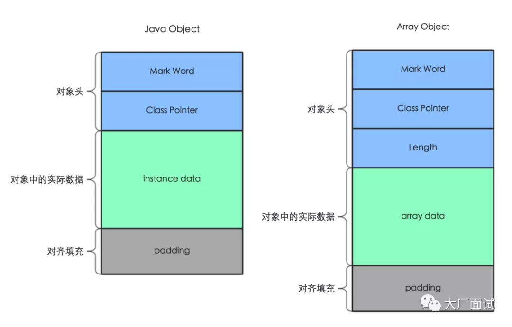
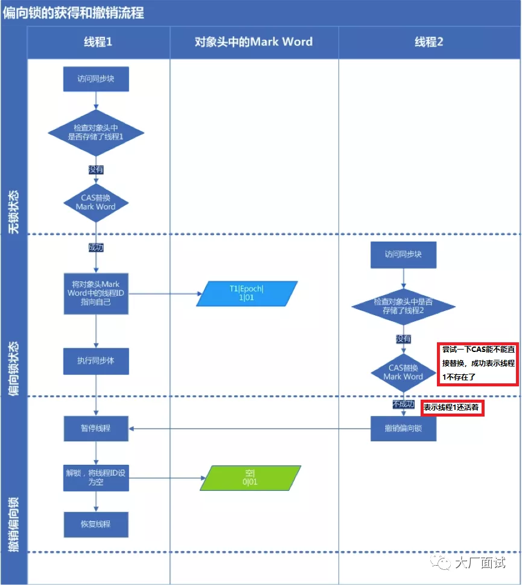
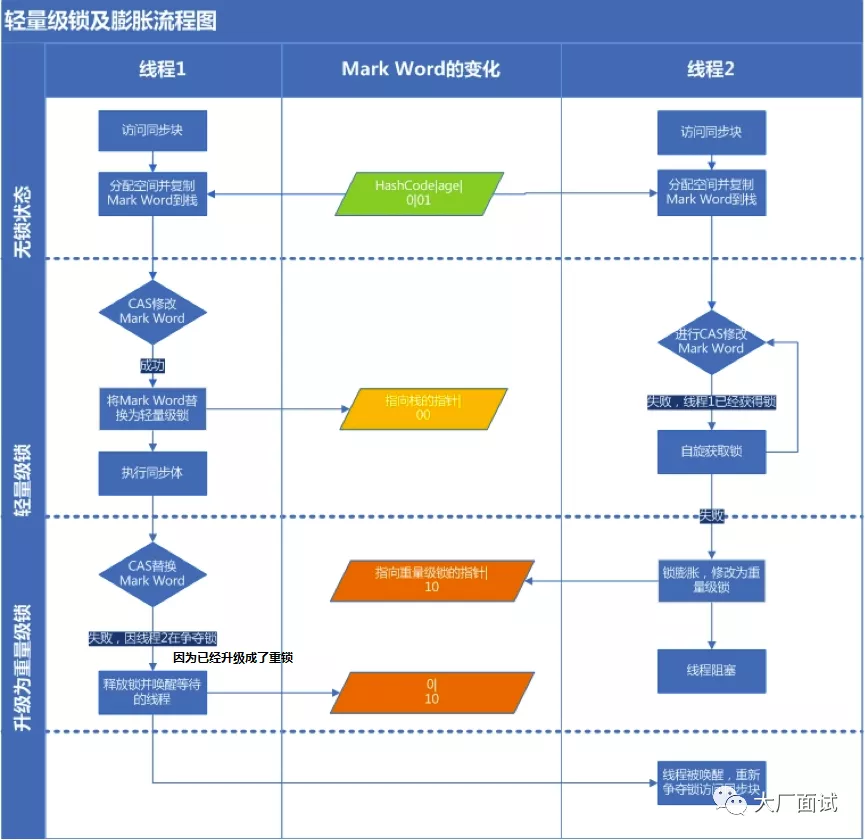
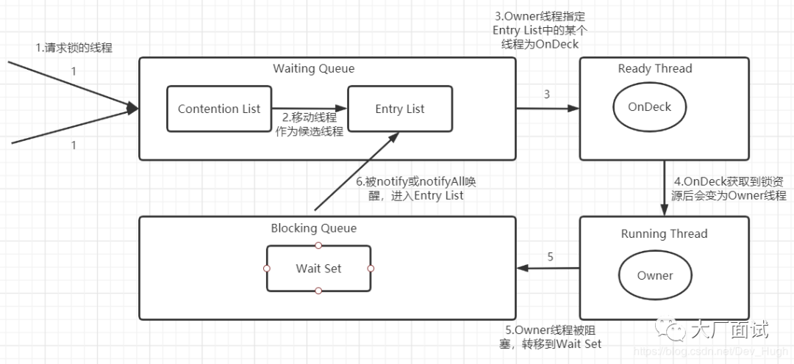

# 锁专题

#### [1.sychronize的实现原理是怎么样的？](#sychronize的实现原理是怎么样的？)
#### [2.AbstractQueuedSynchronizer(缩写为AQS)是什么？](#AbstractQueuedSynchronizer(缩写为AQS)是什么？)

#### [3.悲观锁和乐观锁是什么？](#悲观锁和乐观锁是什么？)

### sychronize的实现原理是怎么样的？

```java
public class SyncTest {
    public void syncBlock(){
        synchronized (this){
            System.out.println("hello block");
        }
    }
    public synchronized void syncMethod(){
        System.out.println("hello method");
    }
}
```

当SyncTest.java被编译成class文件的时候，`synchronized`关键字和`synchronized`方法的字节码略有不同，我们可以用`javap -v` 命令查看class文件对应的JVM字节码信息，部分信息如下：

```java
{
  public void syncBlock();
    descriptor: ()V
    flags: ACC_PUBLIC
    Code:
      stack=2, locals=3, args_size=1
         0: aload_0
         1: dup
         2: astore_1
         3: monitorenter				 	  // monitorenter指令进入同步块
         4: getstatic     #2                  // Field java/lang/System.out:Ljava/io/PrintStream;
         7: ldc           #3                  // String hello block
         9: invokevirtual #4                  // Method java/io/PrintStream.println:(Ljava/lang/String;)V
        12: aload_1
        13: monitorexit						  // monitorexit指令退出同步块
        14: goto          22
        17: astore_2
        18: aload_1
        19: monitorexit						  // monitorexit指令退出同步块
        20: aload_2
        21: athrow
        22: return
      Exception table:
         from    to  target type
             4    14    17   any
            17    20    17   any
 

  public synchronized void syncMethod();
    descriptor: ()V
    flags: ACC_PUBLIC, ACC_SYNCHRONIZED      //添加了ACC_SYNCHRONIZED标记
    Code:
      stack=2, locals=1, args_size=1
         0: getstatic     #2                  // Field java/lang/System.out:Ljava/io/PrintStream;
         3: ldc           #5                  // String hello method
         5: invokevirtual #4                  // Method java/io/PrintStream.println:(Ljava/lang/String;)V
         8: return
 
}
```

对于`synchronized`关键字而言，`javac`在编译时，会生成对应的`monitorenter`和`monitorexit`指令分别对应`synchronized`同步块的进入和退出，有两个`monitorexit`指令的原因是为了保证抛异常的情况下也能释放锁，所以`javac`为同步代码块添加了一个隐式的try-finally，在finally中会调用`monitorexit`命令释放锁。

而对于`synchronized`方法而言，`javac`为其生成了一个`ACC_SYNCHRONIZED`关键字，在JVM进行方法调用时，发现调用的方法被`ACC_SYNCHRONIZED`修饰，则会先尝试获得锁。

#### synchronized锁执行流程图

这是网上看到的一个流程图：


就是Java对象的内存布局其实由对象头+实例数据+对齐填充三部分组成，而对象头主要包含Mark Word+指向对象所属的类的指针组成。Mark Word主要用于存储对象自身的运行时数据，哈希码，GC分代年龄，锁标志等。



下面就是Mark Word的数据映射表


#### 偏向锁

根据上面的表来看，Mark Word后三位为101时，加锁对象的状态为偏向锁，偏向锁的意义在于同一个线程访问sychronize代码块时不需要进行加锁，解锁操作，性能开销更低（HotSpot[1]的作者经过研究发现，大多数情况下，锁不仅不存在多线程竞争，而且总是由同一线程多次获得，为了让线程获得锁的代价更低而引入了偏向锁。）

因为正常情况下，当一个线程访问同步块并获取轻量级锁时，需要进行CAS操作将对象头的锁记录里指向当前线程的栈中的锁记录，执行完毕后需要释放轻量级锁。如果是同一个线程多次访问sychronize代码块，多次获取和释放轻量级，开销会偏大，所以会一开始判断对象是无锁状态，会将对象头设置为偏向锁，并且这个的线程ID添加到锁对象的Mark Word中，后续同一线程判断加锁标志是偏向锁，并且线程ID一致就可以直接执行。偏向锁的加锁过程：

##### 场景一：当锁对象第一次被线程获得锁的时候

线程发现是匿名偏向状态（也就是锁对象的Mark Word没有存储线程ID），则会用CAS指令，将 `mark word`中的thread id由0改成当前线程Id。如果成功，则代表获得了偏向锁，继续执行同步块中的代码。否则，将偏向锁撤销，升级为轻量级锁。

##### 场景二：当获取偏向锁的线程再次进入同步块时

发现锁对象存储的线程ID就是当前线程的ID，会往当前线程的栈中添加一条 `DisplacedMarkWord`为空的 `LockRecord`中，然后继续执行同步块的代码，因为操纵的是线程私有的栈，因此不需要用到CAS指令；由此可见偏向锁模式下，当被偏向的线程再次尝试获得锁时，仅仅进行几个简单的操作就可以了，在这种情况下， `synchronized`关键字带来的性能开销基本可以忽略。

##### 场景二：当没有获得锁的线程进入同步块时

当没有获得锁的线程进入同步块时，发现当前是偏向锁状态，并且存储的是其他线程ID（也就是其他线程正在持有偏向锁），则会进入到**撤销偏向锁**的逻辑里，一般来说，会在 `safepoint`中去查看偏向的线程是否还存活

- 如果线程存活且还在同步块中执行， 则将锁升级为轻量级锁，原偏向的线程继续拥有锁，只不过持有的是轻量级锁，继续执行代码块，执行完之后按照轻量级锁的解锁方式进行解锁，而其他线程则进行自旋，尝试获得轻量级锁。
- 如果偏向的线程已经不存活或者不在同步块中， 则将对象头的 `mark word`改为无锁状态（unlocked）

由此可见，偏向**锁升级**的时机为：**当一个线程获得了偏向锁，在执行时，只要有另一个线程尝试获得偏向锁，并且当前持有偏向锁的线程还在同步块中执行，则该偏向锁就会升级成轻量级锁。**

#### 偏向锁的解锁过程

因此偏向锁的解锁很简单，其仅仅将线程的栈中的最近一条 `lockrecord`的 `obj`字段设置为null。需要注意的是，偏向锁的解锁步骤中**并不会修改锁对象Mark Word中的thread id，简单的说就是锁对象处于偏向锁时，Mark Word中的thread id 可能是正在执行同步块的线程的id，也可能是上次执行完已经释放偏向锁的thread id**，主要是为了上次持有偏向锁的这个线程在下次执行同步块时，判断Mark Word中的thread id相同就可以直接执行，而不用通过CAS操作去将自己的thread id设置到锁对象Mark Word中。**这是偏向锁执行的大概流程：**

#### 轻量级锁

重量级锁依赖于底层的操作系统的Mutex Lock来实现的，但是由于使用Mutex Lock需要将当前线程挂起并从用户态切换到内核态来执行，这种切换的代价是非常昂贵的，而在大部分时候可能并没有多线程竞争，只是多个线程交替执行，（例如：这段时间是线程A执行同步块，另外一段时间是线程B来执行同步块，仅仅是多线程交替执行，并不是同时执行，也没有竞争），如果采用重量级锁效率比较低。以及在重量级锁中，没有获得锁的线程会阻塞，获得锁之后线程会被唤醒，阻塞和唤醒的操作是比较耗时间的，如果同步块的代码执行比较快，等待锁的线程可以进行先进行自旋操作（就是不释放CPU，执行一些空指令或者是几次for循环），等待获取锁，这样效率比较高。所以轻量级锁天然瞄准不存在锁竞争的场景，如果存在锁竞争但不激烈，仍然可以用自旋锁优化，自旋失败后再升级为重量级锁。

##### 轻量级锁的加锁过程

JVM会为每个线程在当前线程的栈帧中创建用于存储锁记录的空间，我们称为Displaced Mark Word。如果一个线程获得锁的时候发现是轻量级锁，会把锁的Mark Word复制到自己的Displaced Mark Word里面。

然后线程尝试**用CAS操作将自己线程栈中拷贝的锁记录的地址写入到锁对象的Mark Word中**。如果成功，当前线程获得锁，如果失败，表示Mark Word已经被替换成了其他线程的锁记录，说明在与其它线程竞争锁，当前线程就尝试使用**自旋**来获取锁。

自旋：不断尝试去获取锁，一般用循环来实现。

自旋是需要消耗CPU的，如果一直获取不到锁的话，那该线程就一直处在自旋状态，白白浪费CPU资源。

JDK采用了适应性自旋，简单来说就是线程如果自旋成功了，则下次自旋的次数会更多，如果自旋失败了，则自旋的次数就会减少。

自旋也不是一直进行下去的，如果自旋到一定程度（和JVM、操作系统相关），依然没有获取到锁，称为自旋失败，那么这个线程会阻塞。同时这个锁就会升级成重量级锁。

#### 轻量级锁的释放流程

在释放锁时，当前线程会使用CAS操作将Displaced Mark Word的内容复制回锁的Mark Word里面。如果没有发生竞争，那么这个复制的操作会成功。如果有其他线程因为自旋多次导致轻量级锁升级成了重量级锁，那么CAS操作会失败，此时会释放锁并唤醒被阻塞的线程。**轻量级锁的加锁解锁流程图：**



#### 重量级锁

每个对象都有一个监视器monitor对象，重量级锁就是由对象监视器monitor来实现的，当多个线程同时请求某个重量级锁时，重量级锁会设置几种状态用来区分请求的线程：

**Contention List 竞争队列**：所有请求锁的线程将被首先放置到该竞争队列，我也不知道为什么网上的文章都叫它队列，其实这个队列是先进后出的，更像是栈，就是当Entry List为空时，Owner线程会直接从Contention List的队列尾部（后加入的线程中）取一个线程，让它成为OnDeck线程去竞争锁。(主要是刚来获取重量级锁的线程是会进行自旋操作来获取锁，获取不到才会进入Contention List，所以OnDeck线程主要与刚进来还在自旋，还没有进入到Contention List的线程竞争)

**Entry List 候选队列**：Contention List中那些有资格成为候选人的线程被移到Entry List，主要是为了减少对Contention List的并发访问，因为既会添加新线程到队尾，也会从队尾取线程。

**Wait Set 等待队列**：那些调用wait()方法被阻塞的线程被放置到Wait Set。

**OnDeck**：任何时刻最多Entry List中只能有一个线程被选中，去竞争锁，该线程称为OnDeck线程。

**Owner**：获得锁的线程称为Owner。

**!Owner**：释放锁的线程。

##### 重量级锁执行流程：

流程图如下：

**步骤1**是线程在进入Contention List时阻塞等待之前，程会先尝试自旋使用CAS操作获取锁，如果获取不到就进入Contention List队列的尾部(所以不是公平锁)。

**步骤2**是Owner线程在解锁时，如果Entry List为空，那么会先将Contention List中队列尾部的部分线程移动到Entry List。(所以Contention List相当于是后进先出，所以也是不公平的)

**步骤3**是Owner线程在解锁时，如果Entry List不为空，从Entry List中取一个线程，让它成为OnDeck线程，Owner线程并不直接把锁传递给OnDeck线程，而是把锁竞争的权利交给OnDeck，OnDeck需要重新竞争锁，JVM中这种选择行为称为 “竞争切换”。（主要是与还没有进入到Contention List，还在自旋获取重量级锁的线程竞争）

**步骤4**就是OnDeck线程获取到锁，成为Owner线程进行执行。

等待和通知步骤(这是调用了wait()和notify()方法才有的步骤)：

在同步块中，获得了锁的线程调用锁对象的Object.wait()方法，就是Owner线程调用锁对象的wait()方法进行等待，会移动到Wait Set中，并且会释放CPU资源，也同时释放锁，

就是当其他线程调用锁对象的Object.notify()方法，之前调用wait方法等待的这个线程才会从Wait Set移动到Entry List，等待获取锁。

##### 3.为什么说是轻量级，重量级锁是不公平的？

偏向锁由于不涉及到多个线程竞争，所以谈不上公平不公平，轻量级锁获取锁的方式是多个线程进行自旋操作，然后使用**用CAS操作将锁的Mark Word中存储的Lock Word替换为指向自己线程栈中拷贝的锁记录的指针**，所以谁能获得锁就看运气，不看先后顺序。重量级锁不公平主要在于刚进入到重量级的锁的线程不会直接进入Contention List队列，而是自旋去获取锁，所以后进来的线程也有一定的几率先获得到锁，所以是不公平的。

##### 4.重量级锁为什么需要自旋操作？

因为那些处于ContetionList、EntryList、WaitSet中的线程均处于阻塞状态，阻塞操作由操作系统完成（在Linxu下通过pthreadmutexlock函数）。线程被阻塞后便进入内核（Linux）调度状态，这个会导致系统在用户态与内核态之间来回切换，严重影响锁的性能。如果同步块中代码比较少，执行比较快的话，后进来的线程先自旋获取锁，先执行，而不进入阻塞状态，减少额外的开销，可以提高系统吞吐量。

##### 5.什么时候会发生锁升级，锁降级？

**偏向锁升级为轻量级锁：**就是有不同的线程竞争锁时。具体来看就是当一个线程发现当前锁状态是偏向锁，然后锁对象存储的Thread id是其他线程的id，并且去Thread id对应的线程栈查询到的lock record的obj字段不为null（代表当前持有偏向锁的线程还在执行同步块）。那么该偏向锁就会升级成轻量级锁。

**轻量级锁升级为重量级锁：**就是在轻量级锁中，没有获取到锁的线程进行自旋，自旋到一定次数还没有获取到锁就会进行锁升级，因为自旋也是占用CPU的，长时间自旋也是很耗性能的。

**锁降级**因为如果没有多线程竞争，还是使用重量级锁会造成额外的开销，所以当JVM进入SafePoint安全点（可以简单的认为安全点就是所有用户线程都停止的，只有JVM垃圾回收线程可以执行）的时候，会检查是否有闲置的Monitor，然后试图进行降级。

##### 6.偏向锁，轻量锁，重量锁的适用场景，优缺点是什么？

偏向锁：加锁解锁不需要进行CAS操作，适合一个线程多次访问同步块的场景。

轻量级锁：加锁和解锁使用CAS操作，没有像重量级锁那样底层操作系统的互斥量来加锁解锁，不涉及到用户态和内核态的切换和线程阻塞唤醒造成的线程上下文切换。没有获得锁的线程会自旋空耗CPU，造成一些开销。适合多线程竞争比较少，但是会有多线程交替执行的场景。

重量级锁：使用到了底层操作系统的互斥量来加锁解锁，但是会涉及到用户态和内核态的切换和线程阻塞和唤醒造成的线程上下文切换，但是不会自旋空耗CPU。


参考文章：

[死磕Synchronized底层实现--概论](https://github.com/farmerjohngit/myblog/issues/12)

[浅谈偏向锁、轻量级锁、重量级锁](https://www.jianshu.com/p/36eedeb3f912)

### AbstractQueuedSynchronizer(缩写为AQS)是什么？

AQS就是AbstractQueuedSynchronizer，抽象队列同步器，是一个可以用于实现基于先进先出等待队列的锁和同步器的框架。实现锁
ReentrantLock，Semaphore，ReentrantReadWriteLock，SynchronousQueue，FutureTask等等皆是基于AQS的。

ReentrantLock其实就是有一个变量sync，Sync父类是AbstractQueuedSynchronizer

```java
public class ReentrantLock implements Lock, java.io.Serializable {
			private final Sync sync;
}
```

ReentrantLock的非公平锁与公平锁的区别在于非公平锁在CAS更新state失败后会调用tryAcquire()来判断是否需要进入同步队列，会再次判断state的值是否为0，为0会去CAS更新state值，更新成功就直接获得锁，否则就进入等待队列。(进等待队列之前会抢锁)

而公平锁首先判断state是否为0，为0并且等待队列为空，才会去使用CAS操作抢占锁，抢占成功就获得锁，没成功并且当前线程不是获得锁的线程，都会被加入到等待队列。

参考资料：

深入理解ReentrantLock的实现原理

### 悲观锁和乐观锁是什么？

##### 悲观锁

就是假定在每次取数据的时候会修改这个数据，所以在取数据的时候就会进行加锁，这样其他调用者就不能取数据，阻塞等待，一直到获取到锁。Java中的同步锁sychronized和ReentrantLock就是悲观锁思想的实现。

##### 乐观锁

就是假定在每次取数据时不会修改这个数据，所以在取数据的时候不会加锁，只有在真正修改数据时才加锁。Java中的atomic原子变量类就是乐观锁的实现。

##### 区别:

悲观锁适合多写的场景

乐观锁适合多读的场景，这样只有读写冲突会发生的比较少，减少加锁的性能开销。但是如果是多写的场景，这样会导致上层应用一直重试，增加性能开销。

#### 乐观锁的实现

##### 版本号机制

使用版本号来实现，对数据加上一个版本号，代表修改次数，每次修改后+1，修改数据时判断数据的版本号跟之前取的是否一致，一致才修改，不一致就重试，直到更新成功。

##### CAS操作

就是在更新数据时会传入之前取的值，在内存中判断当前内存中的值跟之前的值是否一致，一致再更新，（比较和更新都是在一个原子操作中）。

##### ABA问题怎么解决？

使用CAS更新是没法解决ABA的问题，就是其他调用方对数据修改成其他值后又改回原来的值。AtomicStampedReference的compareAndSet会先判断对象的引用是否相同，相同才进行CAS更新。实现原理主要是AtomicStampedReference会保存之前对象的的引用，及一个修改版本号，只有当引用和版本号都相等的情况下，才会进行CAS更新操作。

##### CAS操作的缺点有哪些？

1.循环时间长开销大

自旋CAS操作如果不成功就一直循环执行直到成功，如果长时间不成功，会给CPU带来非常大的执行开销

2.CAS 只对单个共享变量有效

多个变量放在一个对象里来进行 CAS 操作.所以我们可以使用锁或者利用`AtomicReference类`把多个共享变量合并成一个共享变量来操作

#### Java的原子类

原子类一共有以下四种

- 1.基本类型: AtomicInteger, AtomicLong, AtomicBoolean ;
- 2.数组类型: AtomicIntegerArray, AtomicLongArray, AtomicReferenceArray ;
- 3.引用类型: AtomicReference, AtomicStampedRerence, AtomicMarkableReference ;
- 4.对象的属性修改类型: AtomicIntegerFieldUpdater, AtomicLongFieldUpdater, AtomicReferenceFieldUpdater 。

##### AtomicInteger

主要是对Integer的封装，提供了一些原子性的操作，因为如果是使用Integer来完成i=i+1;操作，在内存中是三个步骤，先将从内存中取出i，放到寄存器中，然后将寄存器中的值与1相加，然后将结果写入内存，一共是三个步骤，所以不是原子性的，并发时会造成数据不一致的问题。

主要实现原理是AtomicInteger类有一个unsafe属性，可以通过unsafe来调用Unsafe类的一些原子性的方法Unsafe.compareAndSwapInt来实现原子性的加减运算。

其次是使用volatile来修饰value属性，保证一个内存可见性

```java
//compareAndSwapInt有四个参数，第一个是待运算的对象，第二个是对象中用于运算的属性的偏移量，第三个是期望值，第四个是更新的值。
unsafe.compareAndSwapInt(this, valueOffset, expect, update)
```

```java
public class AtomicInteger extends Number implements java.io.Serializable {
    private static final long serialVersionUID = 6214790243416807050L;

    // setup to use Unsafe.compareAndSwapInt for updates
    private static final Unsafe unsafe = Unsafe.getUnsafe();
    private static final long valueOffset;

    static {
        try {
            valueOffset = unsafe.objectFieldOffset
                (AtomicInteger.class.getDeclaredField("value"));
        } catch (Exception ex) { throw new Error(ex); }
    }

    private volatile int value;//使用volatiole来保证value的内存可见性
}

```

在Unsafe类中，compareAndSwapInt和getAndAddInt的区别在于，getAndAddInt会一直重试直到成功，compareAndSwapInt如果更新失败，只会返回false

```java
public final int getAndAddInt(Object var1, long var2, int var4) {
    int var5;
    do {
      //var1是对象，var2是对象上某个变量的偏移量，
      //var5就是对象var1上偏移量为var2的一个变量
        var5 = this.getIntVolatile(var1, var2);
      //当var5的值没有变化时，就会进行加法操作，也就是var5 = var5 + var4
    } while(!this.compareAndSwapInt(var1, var2, var5, var5 + var4));

    return var5;
}
```