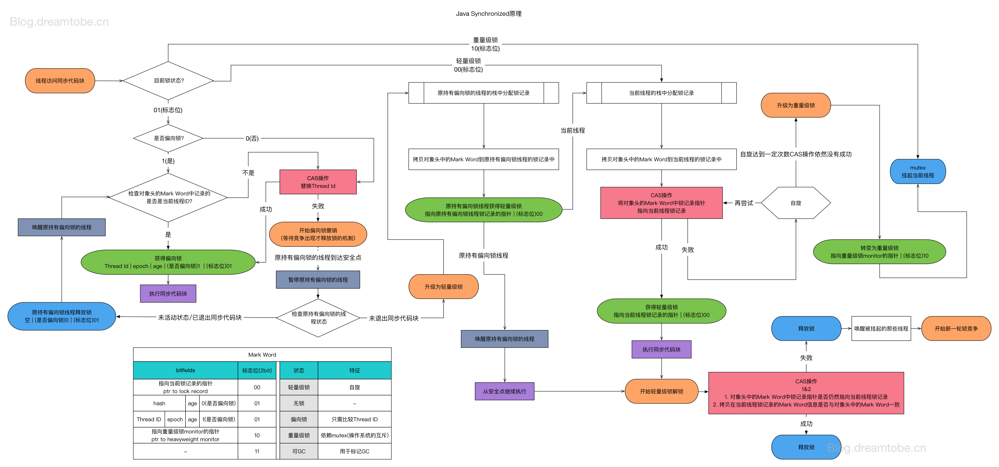
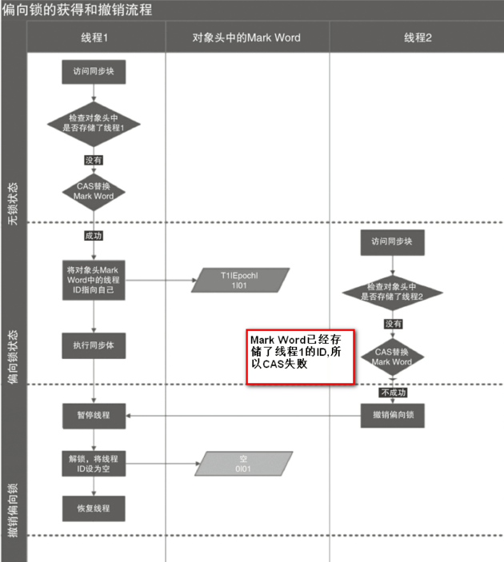
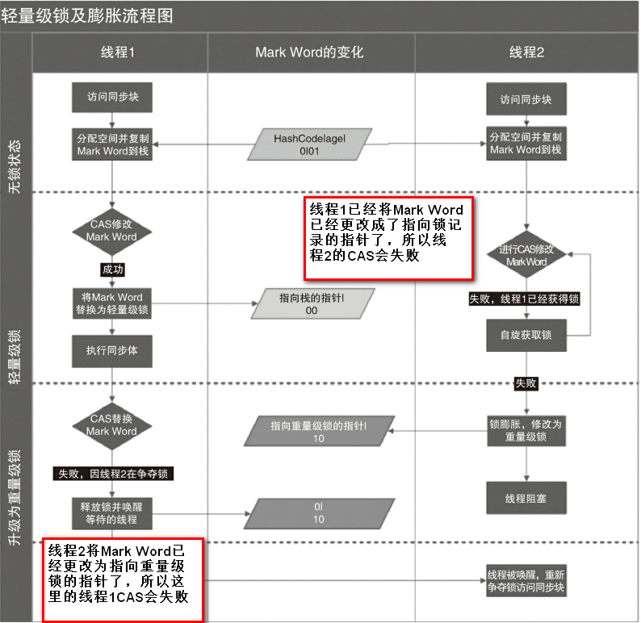
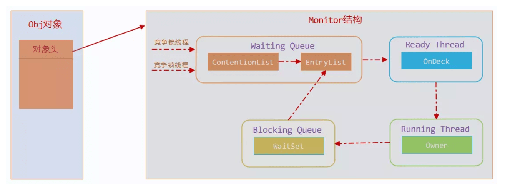

# 锁专题

#### [1.sychronize的实现原理是怎么样的？](#sychronize的实现原理是怎么样的？)
#### [2.AbstractQueuedSynchronizer(缩写为AQS)是什么？](#AbstractQueuedSynchronizer(缩写为AQS)是什么？)

### sychronize的实现原理是怎么样的？

```java
public class SyncTest {
    public void syncBlock(){
        synchronized (this){
            System.out.println("hello block");
        }
    }
    public synchronized void syncMethod(){
        System.out.println("hello method");
    }
}
```

当SyncTest.java被编译成class文件的时候，`synchronized`关键字和`synchronized`方法的字节码略有不同，我们可以用`javap -v` 命令查看class文件对应的JVM字节码信息，部分信息如下：

```java
{
  public void syncBlock();
    descriptor: ()V
    flags: ACC_PUBLIC
    Code:
      stack=2, locals=3, args_size=1
         0: aload_0
         1: dup
         2: astore_1
         3: monitorenter				 	  // monitorenter指令进入同步块
         4: getstatic     #2                  // Field java/lang/System.out:Ljava/io/PrintStream;
         7: ldc           #3                  // String hello block
         9: invokevirtual #4                  // Method java/io/PrintStream.println:(Ljava/lang/String;)V
        12: aload_1
        13: monitorexit						  // monitorexit指令退出同步块
        14: goto          22
        17: astore_2
        18: aload_1
        19: monitorexit						  // monitorexit指令退出同步块
        20: aload_2
        21: athrow
        22: return
      Exception table:
         from    to  target type
             4    14    17   any
            17    20    17   any
 

  public synchronized void syncMethod();
    descriptor: ()V
    flags: ACC_PUBLIC, ACC_SYNCHRONIZED      //添加了ACC_SYNCHRONIZED标记
    Code:
      stack=2, locals=1, args_size=1
         0: getstatic     #2                  // Field java/lang/System.out:Ljava/io/PrintStream;
         3: ldc           #5                  // String hello method
         5: invokevirtual #4                  // Method java/io/PrintStream.println:(Ljava/lang/String;)V
         8: return
 
}
```

对于`synchronized`关键字而言，`javac`在编译时，会生成对应的`monitorenter`和`monitorexit`指令分别对应`synchronized`同步块的进入和退出，有两个`monitorexit`指令的原因是为了保证抛异常的情况下也能释放锁，所以`javac`为同步代码块添加了一个隐式的try-finally，在finally中会调用`monitorexit`命令释放锁。

而对于`synchronized`方法而言，`javac`为其生成了一个`ACC_SYNCHRONIZED`关键字，在JVM进行方法调用时，发现调用的方法被`ACC_SYNCHRONIZED`修饰，则会先尝试获得锁。

#### 锁

这是网上看到的一个流程图：



就是Java对象的内存布局其实由对象头+实例数据+对齐填充三部分组成，而对象头主要包含Mark Word+指向对象所属的类的指针组成。Mark Word主要用于存储对象自身的运行时数据，哈希码，GC分代年龄，锁标志等。

下面就是Mark Word的数据映射表


##### 偏向锁

根据上面的表来看，Mark Word后三位为101时，加锁对象的状态为偏向锁，偏向锁的意义在于同一个线程访问sychronize代码块时不需要进行加锁，解锁操作，性能开销更低（HotSpot[1]的作者经过研究发现，大多数情况下，锁不仅不存在多线程竞争，而且总是由同一线程多次获得，为了让线程获得锁的代价更低而引入了偏向锁。）

因为正常情况下，当一个线程访问同步块并获取轻量级锁时，需要进行CAS操作将对象头的锁记录里指向当前线程的栈中的锁记录，执行完毕后需要释放轻量级锁。如果是同一个线程多次访问sychronize代码块，多次获取和释放轻量级，开销会偏大，所以会一开始判断对象是无锁状态，会将对象头设置为偏向锁，并且这个的线程ID到Mark Word，后续同一线程判断加锁标志是偏向锁，并且线程ID一致就可以直接执行。



#### 轻量级锁

JVM的开发者发现在很多情况下，在Java程序运行时，同步块中的代码都是不存在竞争的，不同的线程交替的执行同步块中的代码。这种情况下，用重量级锁是没必要的。因此JVM引入了轻量级锁的概念。

线程在执行同步块之前，JVM会先在当前的线程的栈帧中创建一个`Lock Record`，其包括一个用于存储对象头中的 `mark word`（官方称之为`Displaced Mark Word`）以及一个指向对象的指针。下图右边的部分就是一个`Lock Record`。


(1)轻量级锁加锁 

线程在执行同步块之前，JVM会先在当前线程的栈桢中创建用于存储锁记录的空间，并 将对象头中的Mark Word复制到锁记录中，官方称为Displaced Mark Word。然后线程尝试使用 CAS将对象头中的Mark Word替换为指向锁记录的指针。如果成功，当前线程获得锁，如果失败，表示其他线程竞争锁，当前线程便尝试使用自旋来获取锁，自旋获取锁失败的次数达到一定次数后就会进行锁升级，将锁升级为重量级锁，当前线程就会被阻塞，直到获得轻量级锁的线程执行完毕，释放锁，唤醒阻塞的线程。 

(2)轻量级锁解锁 

轻量级解锁时，会使用原子的CAS操作将Displaced Mark Word替换回到对象头，如果成 功，则表示没有竞争发生。如果失败，表示当前锁存在竞争，锁就会膨胀成重量级锁。图2-2是 两个线程同时争夺锁，导致锁膨胀的流程图。 



### 重量级锁

重量级锁是我们常说的传统意义上的锁，其利用操作系统底层的同步机制去实现Java中的线程同步。

重量级锁的状态下，对象的`mark word`为指向一个堆中monitor对象的指针。

一个monitor对象包括这么几个关键字段：cxq（下图中的ContentionList），EntryList ，WaitSet，owner。

其中cxq ，EntryList ，WaitSet都是由ObjectWaiter的链表结构，owner指向持有锁的线程。



当一个线程尝试获得锁时，如果该锁已经被占用，则会将该线程封装成一个ObjectWaiter对象插入到cxq的队列尾部，然后暂停当前线程。当持有锁的线程释放锁前，会将cxq中的所有元素移动到EntryList中去，并唤醒EntryList的队首线程。

如果一个线程在同步块中调用了`Object#wait`方法，会将该线程对应的ObjectWaiter从EntryList移除并加入到WaitSet中，然后释放锁。当wait的线程被notify之后，会将对应的ObjectWaiter从WaitSet移动到EntryList中。

#### 三种锁的优缺点对比


参考文章：

[死磕Synchronized底层实现--概论](https://github.com/farmerjohngit/myblog/issues/12)

[浅谈偏向锁、轻量级锁、重量级锁](https://www.jianshu.com/p/36eedeb3f912)

### AbstractQueuedSynchronizer(缩写为AQS)是什么？

AQS就是AbstractQueuedSynchronizer，队列同步器，内部实现了一个同步队列（一个双向链表，存放没有获取到锁的线程），一个条件等待队列，负责存放等待被唤醒的线程，唤醒后会进入到同步队列。

ReentrantLock其实就是有一个变量sync，Sync父类是AbstractQueuedSynchronizer

```java
public class ReentrantLock implements Lock, java.io.Serializable {
	private final Sync sync;
}
```

ReentrantLock的非公平锁与公平锁的区别在于非公平锁在CAS更新state失败后会调用tryAcquire()来判断是否需要进入同步队列，会再次判断state的值是否为0，为0会去CAS更新state值，更新成功就直接获得锁，否则就进入等待队列。

而公平锁首先判断state是否为0，为0并且等待队列为空，才会去使用CAS操作抢占锁，抢占成功就获得锁，没成功并且当前线程不是获得锁的线程，都会被加入到等待队列。

参考资料：

[深入理解ReentrantLock的实现原理]https://mp.weixin.qq.com/s?src=11&timestamp=1595675057&ver=2482&signature=tM4jJR1bsGMBZxest2FY-VBXE8UDCEbqXwezlhRbJy5Ylsp0cWxx-DYrCMMzN2Z1E3rMrOndXCJXdThYx1xc*VBbpYfL4De3WtFgqndniaDTsgGrpBTVhVVx*ASCgZbX&new=1